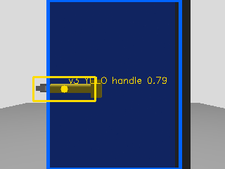
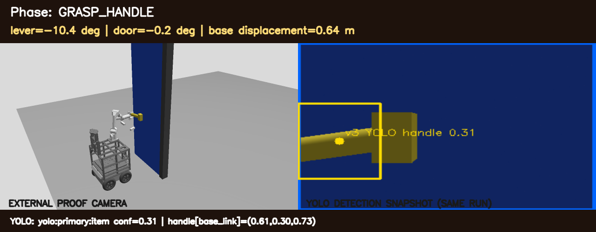
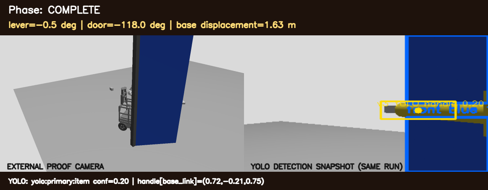
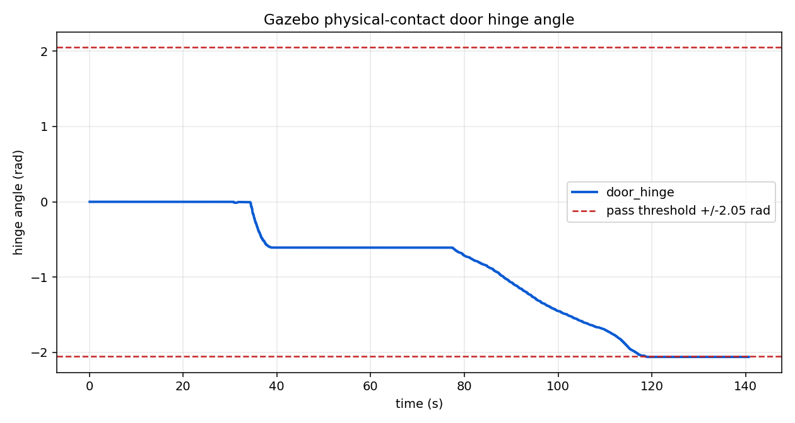

# Handle v3 YOLO + PIPER 물리 문개방 검증

검증일: 2026-09-13

## 검증 범위

이 시험은 자율주행 World 1~5 검증과 분리된 단일 문 집중 시험입니다. 다음 연결을 한 실행 안에서 확인했습니다.

1. Gazebo 카메라 영상에서 Handle v3 YOLO가 레버 bbox를 검출
2. 카메라와 2D LiDAR를 이용해 손잡이 위치를 `base_link` 좌표로 계산
3. 사용자 제공 PIPER 사양의 실제 링크 길이, 관절축, 질량, 관성, 제한을 적용한 수치 IK
4. PIPER 그리퍼가 레버에 접근하고 레버를 아래로 회전
5. 래치 해제 후 팔을 회수하고 모바일 베이스가 패널을 밀어 개방
6. Gazebo joint state로 레버 누름과 문 개방 각도를 판정

## 결과

| 지표 | 측정값 | 판정 |
| --- | ---: | --- |
| 주 YOLO 관측 | 46회 | PASS |
| 최종 선택 방식 | `yolo:primary:item` | PASS |
| 선택 손잡이 좌표 | `(0.712, 0.335, 0.752)m` in `base_link` | PASS |
| 레버 최대 회전 | `0.287rad / 16.4°` | PASS |
| 문 최대/최종 회전 | `2.059rad / 118.0°` | PASS |
| 차체 변위 | `1.630m` | PASS |
| `/open_door` 응답 | `Door opened successfully` | PASS |
| door hinge 직접 명령 | 사용 안 함 | PASS |

성공 조건은 서비스 응답만 보지 않습니다. 레버 회전이 `0.08rad` 이상이고 문 회전이 `2.05rad (117.5°)` 이상이며, 최종 문 각도도 임계값 부근에 남아 있어야 PASS입니다.

최신 강화 기준 실행 결과 원본은 [`physical_contact_result.json`](validation/2026-09-13/physical_contact_result.json)이며 SHA-256은 `6bb145d8b2c76091e642c34d29c42a81be6b4229f6c50ed0d71a11b04ee15ae2`입니다.

## 증거 이미지

### Handle v3 YOLO bbox

### PIPER 레버 누름

### 차체 접촉 완전 개방

### 측정된 힌지 각도

## 코드 경로

- 인식: `src/fire_robot_perception/fire_robot_perception/door_detection_node.py`
- 물리 접촉 FSM: `src/fire_robot_manipulation/fire_robot_manipulation/physical_contact_manipulation_node.py`
- 실제 PIPER 운동학: `src/fire_robot_manipulation/fire_robot_manipulation/piper_actual_kinematics.py`
- 실제 형상 URDF: `src/fire_robot_description/urdf/fire_robot_actual_piper.urdf.xacro`
- 레버/래치 월드: `src/fire_robot_bringup/worlds/physical_contact_door_test.world`
- 재현 스크립트: `src/fire_robot_bringup/scripts/run_physical_contact_door_test.py`

## 해석 제한

- v3 모델은 Gazebo 검출이 우수하지만 팀원 분리 평가의 실제 손잡이 성능은 약 41%였습니다. 실제 로봇 기본 모델은 v2를 유지합니다.
- 이 결과는 단일 문 전용 물리 접촉 시험입니다. World 1~5 자율주행/FSM은 별도 시험에서 PASS했으며, 실제 PIPER 접촉 동작을 모든 월드에 결합한 시험은 남아 있습니다.
- Gazebo의 접촉·마찰 파라미터는 실제 하드웨어 힘 제어를 대체하지 않습니다. 실제 시험에서는 저속 접근, 힘/전류 제한, 비상 정지가 필요합니다.
