# 화재 대응 로봇 핵심 아이디어와 검증 REV6

2026-09-17 | 과거 성공 자료 보존 | 코드/정책 수정 없음


## 01. 관측하고, 기억하고, 실행 결과로 확인한다
화재 대응 모바일 매니퓰레이터 | 핵심 설계·증거 보고서 REV6 | 2026-09-17

### 카메라가 문의 의미를 찾고, 거리 센서가 위치를 보완한다. 지도 위에 문을 기억하여 다음 행동을 정하고, 개방은 명령이 아니라 측정된 반응으로 판단한다.

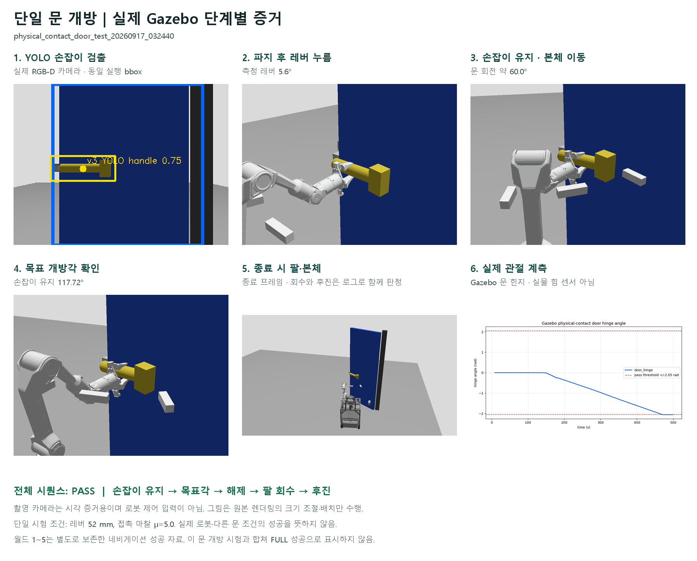

| 검증 축 | 현재 근거 | 발표 시 표현 |
| --- | --- | --- |
| 관측·의미 기억 | 2026-09-09~10 보존 이미지/영상 | 지도 확장·문 기억의 동작 예시 |
| 월드 1~5 주행 | 2026-09-16, 5개 월드 검사 PASS | 저장 지도 기반 주행 회귀 성공 |
| 손잡이 유지 개방 | 2026-09-17 r40, PASS | 단일 fixture의 접촉 개방·복귀 성공 |
기존 성공 코드·REV4/REV5·과거 원본은 보존했다. 이번 작업은 보고서 재구성과 증거 재분석이며 새 전체 주행을 수행했다고 표시하지 않는다.


## 02. 보고서 읽는 순서
설명용 도식과 실제 계측을 구분하면 핵심이 선명해진다

| 질문 | 확인할 장 |
| --- | --- |
| 어떻게 처음 보는 환경을 지도화하는가? | 초기 센서 → 초기 맵 → 관측 확장 → 고정층과 갱신층 |
| 어떻게 문을 구별하고 다시 열지 않는가? | 문 YOLO/HSV → 의미 좌표 → 목표 잠금 → 개방 기억 → 재관측 제외 |
| 어떻게 장애물을 피하고 문 앞으로 가는가? | 회피 우선순위 → Nav2 → 제어권 → 정렬 |
| 어디까지 관측 기반이고 무엇이 아직 고정인가? | 변경 전후 비교 → IK 접근 → 누름 피드백 → 남은 설정값 |
| 어떤 실험이 성공했는가? | 월드 1~5 각각의 주행 근거 → 최신 단일문 개방 → 한계 |
### 증거 유형

실제 영상/렌더: Gazebo 카메라로 받은 픽셀이다. 진단 화면: 실제 ROS 데이터와 카메라를 조합한 표시이며 Gazebo GUI 원본 화면과 다르다. 계측 그래프: 로그 수치를 다시 그린 것이다. 설명 도식/의사코드: 구조 설명용이며 성공의 독립 증거가 아니다.

### 판정 범위

PASS는 해당 날짜·코드·설정·검사 항목에서 통과했다는 뜻이다. 센서 예시, 주행 회귀, 단일문 접촉을 묶어서 “실제 로봇이 미지의 5개 월드에서 모두 문을 열었다”라고 표현하지 않는다.

영상은 PDF에 재생기를 내장하지 않고 같은 폴더의 MP4와 연결했다. 공유 ZIP을 압축 해제한 뒤 START_보고서와영상.html을 열면 장별 이미지·코드·영상을 함께 볼 수 있다.


## 03. 우리 시스템의 핵심 구조
다섯 책임을 분리하고, 관측은 이동·조작 중에도 계속 쌓는다

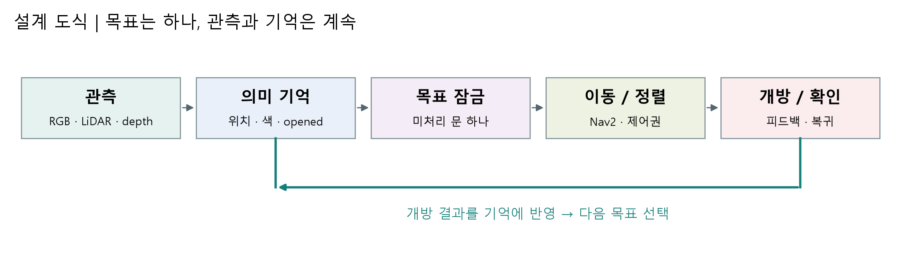

| 대 단계 | 핵심 책임 | 다음 단계로 가는 조건 |
| --- | --- | --- |
| 1 Perception | 문 bbox·색·거리·손잡이·TF를 결합 | 유효한 관측 자료가 준비됨 |
| 2 Memory / Target | 문 위치·색 투표·상태를 기억하고 하나 선택 | 확정 가능한 미처리 파란문을 잠금 |
| 3 Navigation / Align | 장애물 비용을 반영해 이동하고 자세 조정 | 근접 관측·자세·안전 조건 충족 |
| 4 Manipulation | 파지·레버 누름·손잡이 유지 개방·복귀 | 해당 backend의 개방 결과 확인 |
| 5 Next / Exit | opened 기록, 다음 후보 또는 출구 | 미처리 후보 재검토 후 종료 |
### 왜 목표 잠금과 계속 관측이 동시에 필요한가?

새 파란문이 보일 때마다 목표를 바꾸면 경로가 흔들린다. 반대로 관측 자체를 중단하면 이미 본 다음 문을 잊는다. 따라서 현재 실행 목표 하나는 유지하되, 나머지 문 관측은 지도와 기억에 축적한다.

기여점은 새 YOLO/Nav2 알고리즘의 발명보다, 의미 기억·목표 고정·제어권 분리·측정 기반 전이 조건을 연결한 통합 설계에 있다. 기존 라이브러리와 자체 정책을 구분하여 설명한다.


## 04. 관측값과 시험 정답의 경계
센서로 얻은 정보와 평가자가 알고 있는 월드 정보를 섞지 않는다

| 정보 | 사용 위치 | 해석 |
| --- | --- | --- |
| RGB / scan / 등록 depth / TF | 문·장애물·손잡이 위치 추정 | 로봇 입력 경로 |
| landmark / opened 상태 | 목표 제외·다음 문·출구 전환 | 관측에서 만든 작업 기억 |
| 저장 지도 / sim_odom | 보존 월드 1~5의 위치·경로 계산 | 그 실행이 미지 환경 최초 SLAM은 아님 |
| SDF 문·장애물 위치 / 정답 문 수 | 주행 그림·checker·기존 hinge backend 매칭 | 평가/시뮬레이션 지원 정보 |
| 레버·문 Gazebo joint state | 최신 단일문 피드백과 성공 판정 | 계측된 시뮬레이션 입력, 실물 힘 센서 아님 |
### 관측 기반이라는 표현의 정확한 범위

문 후보와 손잡이 픽셀은 관측으로 생성된다. 그러나 시험에서 제공한 지도, 시뮬레이션 위치추정, 문 backend의 모델 매칭까지 없었다는 뜻은 아니다. 이 보고서는 이 세 수준을 별도 표시한다.

실제 로봇에서는 카메라/깊이 등록·외부 TF 교정, odometry/localization, 접촉 또는 레버 반응 센싱이 필요하다. Gazebo joint state를 그대로 실물에서 받을 수 있다고 가정하지 않는다.


## 05. 1. 초기 장면과 센서 입력
2026-09-09 | 보존된 World1 초기 센서 증거

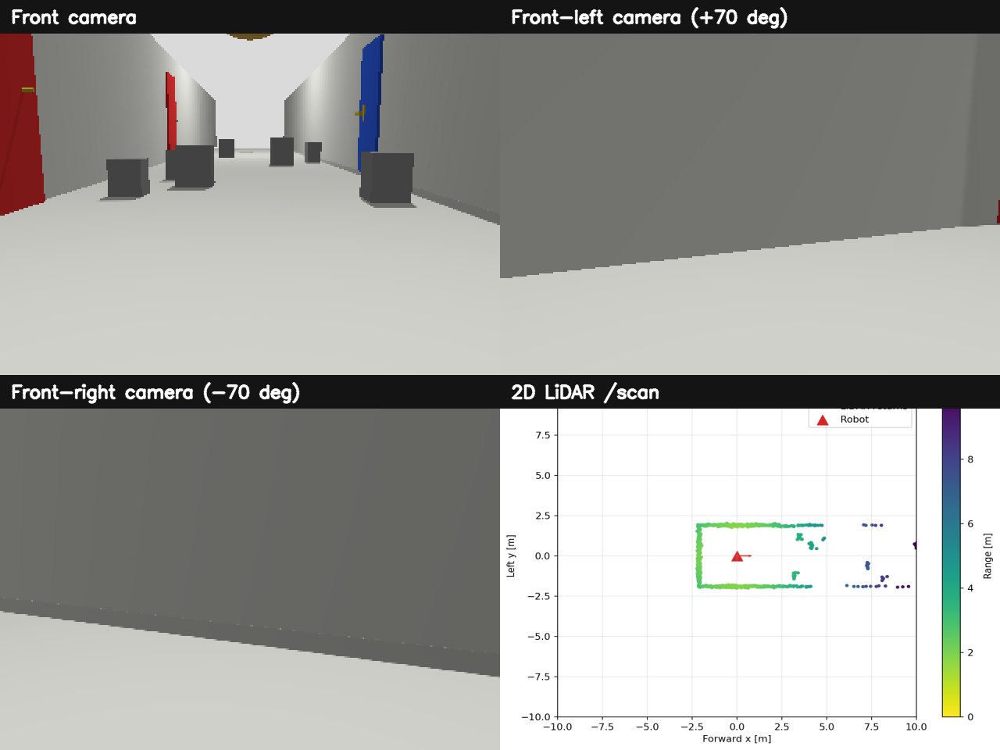

| 입력 | 알 수 있는 것 | 알 수 없는 것 |
| --- | --- | --- |
| 카메라 | 문 bbox, 색상, 손잡이 외형 | 단안 bbox만으로 신뢰할 수 있는 3D 위치 |
| 2D LiDAR | 스캔 평면의 벽·장애물 거리 | 문 색, 스캔 높이 밖의 모든 물체 형상 |
| 등록 RGB-D | 손잡이 픽셀에 대응한 표면 3D 점 | 가림 뒤 형상·접촉력 |
초기 원점은 좌표계 선택일 뿐 환경 정답을 제공하지 않는다. 첫 장면에서 가려진 공간은 아직 모른다. 세 카메라의 배치가 실제 장착과 일치하는지는 실물 외부 파라미터 측정으로 별도 확인해야 한다.


## 06. 2. 처음 가진 지도는 부분 지도다
2026-09-10 | 실시간 SLAM 진단 화면 t=0.2초

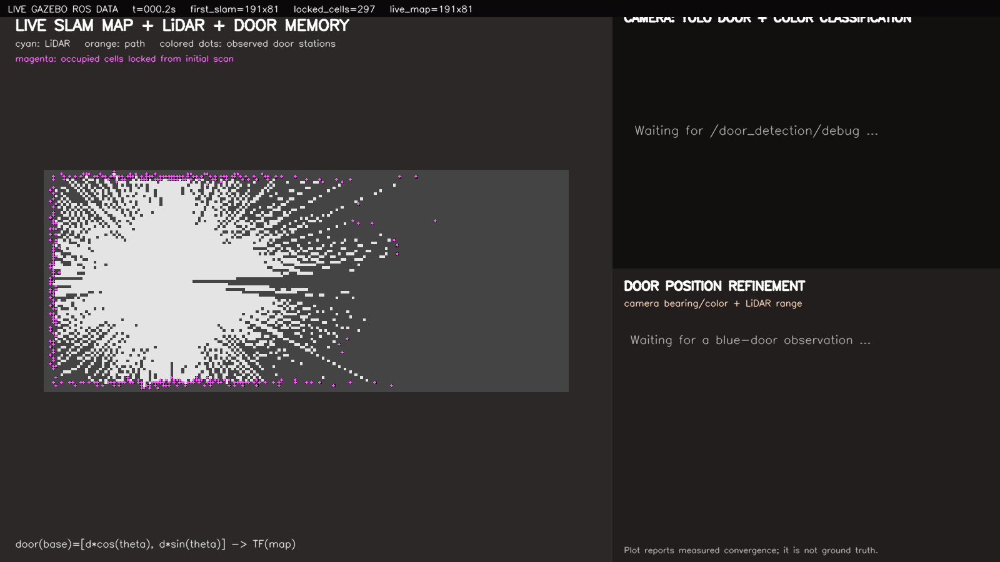

| 화면 요소 | 읽는 방법 |
| --- | --- |
| 밝은/어두운 격자 | 점유·자유·미관측 공간을 구분하는 OccupancyGrid |
| 청록 점 | 그 시점의 LiDAR 거리 관측 |
| 자홍색 점 | 진단 화면이 첫 스캔에서 별도로 보존해 그린 점유 셀 |
| 문 색 점 / 주황 선 | 문 관측 overlay / 기록된 로봇 이동 |
이 그림은 실제 ROS 데이터를 조합한 진단 화면이지 실제 Gazebo GUI 캡처는 아니다. 표시된 첫 스캔 잠금 점만으로 production /initial_static_map과 모든 셀이 같다고 단정할 수 없다. 현재 노드의 고정 동작은 다음 코드 장에서 별도로 확인한다.


## 07. 3. 이동하면 새 공간이 드러난다
같은 관측 과정의 기록 | t=16.2초 → t=29.0초

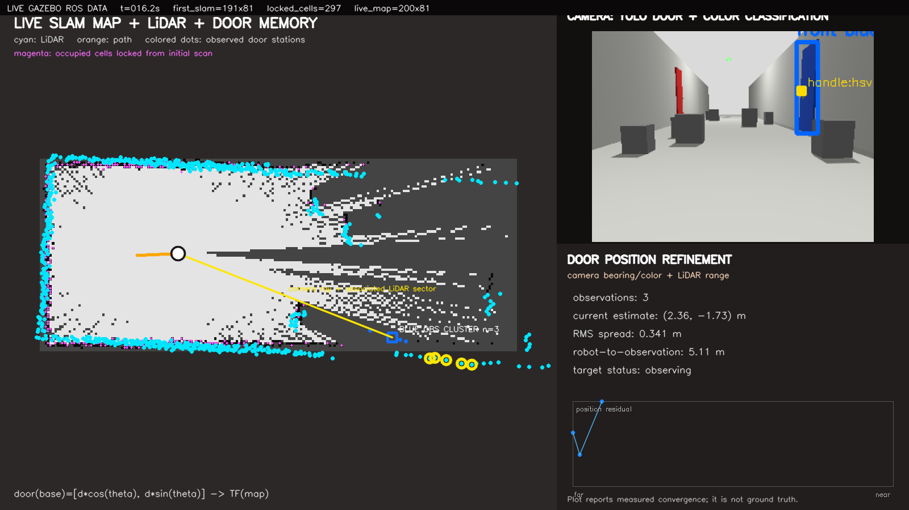

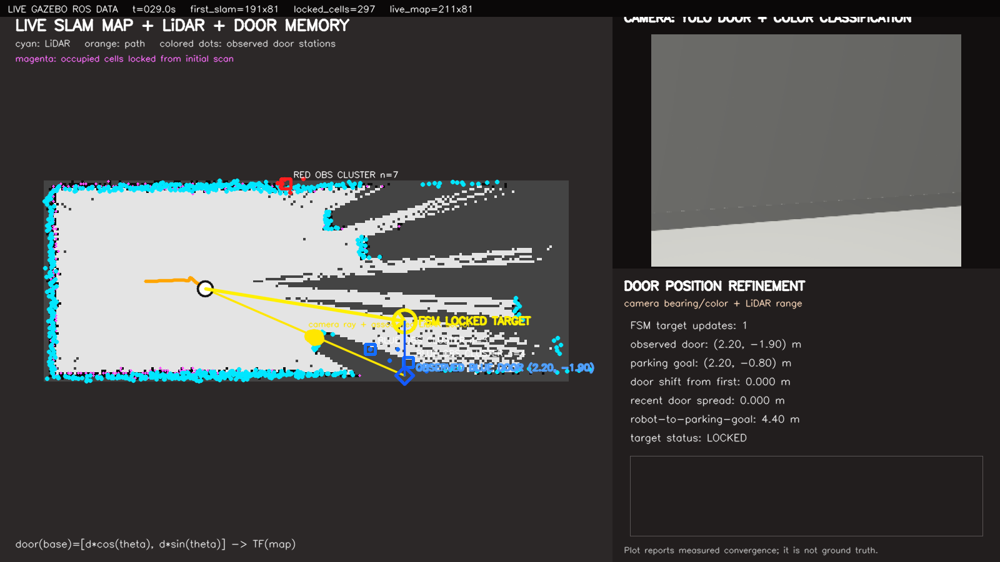

첫 191×81 grid보다 표시 범위가 커지고, 보이지 않던 구역에서 LiDAR와 문 관측이 추가된다. 이는 지도와 의미 관측이 이동 중 갱신된 사례다. 격자 크기 증가만으로 모든 방을 완전히 관측했다거나 기존 셀 오차가 전혀 없다는 결론은 낼 수 없다.

[영상: 실제 관측·문 좌표 진단 과정 (2026-09-10)](09_영상/08_인식과정_실행영상_browser_h264.mp4)


## 08. 4. 고정층과 갱신층을 분리한다
현재 코드 확인 | 한 장의 절대 정답 지도를 계속 덮어쓰는 구조가 아니다

| 층 | 역할 | 현 구현의 주의점 |
| --- | --- | --- |
| /initial_static_map | 첫 유효 지도를 복사해 고정 참조로 유지 | lock 후 source /map 수신을 무시 |
| /map | SLAM 모드에서는 새로운 관측으로 갱신 | SLAM 자체의 기존 영역 보정은 가능 |
| /fixed_obstacle_map | scan+TF로 별도 장애물 overlay 누적 | grid geometry가 바뀌면 overlay 재초기화 |
| 문 의미 기억 | 색·위치·opened를 별도 구조체로 관리 | OccupancyGrid의 색 픽셀 자체가 아님 |
실제 코드: 08_코드발췌와원본/주행보존본/initial_static_map_node.py:103-108
```python
def _map_callback(self, msg: OccupancyGrid):
    if (
            self._captured_once
            and self._lock_after_capture
            and not self._fallback_map_active):
        return
```
초기 캡처 완료·잠금 활성·fallback 아님이면 후속 source map을 받지 않는다.

실제 코드: 08_코드발췌와원본/주행보존본/fixed_obstacle_map_node.py:154-157
```python
lx = math.cos(angle) * distance
ly = math.sin(angle) * distance
mx = sx + cyaw * lx - syaw_sin * ly
my = sy + syaw_sin * lx + cyaw * ly
```
스캔 평면의 점을 현재 scan TF로 map 좌표로 옮긴 뒤 overlay에 반영한다.

중요한 구현 한계: “한 번 본 모든 셀은 영구 불변이고 미관측 셀만 확장”이 전체 맵에 완벽히 구현됐다고 말하면 안 된다. 초기 참조 보존과 live 지도/별도 overlay 갱신이 구현된 것이다.


## 09. 5. 문은 YOLO, 색은 HSV
Door 1-class 검출과 색상 분류를 분리하여 문제를 나눈다

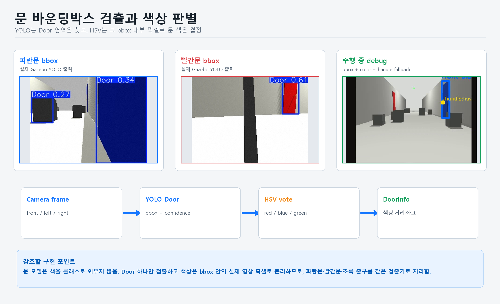

문 YOLO는 Door 범주를 찾는다. 그 bbox 안의 색 분포를 HSV로 분류하여 red/blue/green 의미를 붙인다. 파란문은 작업 대상, 빨간문은 위험 회피 참고, 초록문은 출구 후보로 구분한다.

| 단계 | 왜 분리했는가 |
| --- | --- |
| 형태: YOLO | 단순 색 덩어리와 문 형태를 구분하기 위한 단서 |
| 색: HSV | Door 학습 모델을 유지하면서 색에 따른 임무 정책 변경 |
| 시간: 반복 관측 | 한 프레임의 오탐·색 흔들림을 문 기억에서 재검토 |
이 이미지에는 검은 장애물 위 낮은 점수 Door 0.27 오탐도 보인다. 우측 handle:hsv는 과거 손잡이 fallback이므로 최신 손잡이 YOLO 증거로 사용하지 않는다. 모델이 완벽하다는 사례가 아니라 처리 과정의 실제 예시다.


## 10. 6. 색 점은 LiDAR가 본 색이 아니다
카메라 의미 + 거리 관측 + TF → 지도 위 문 관측

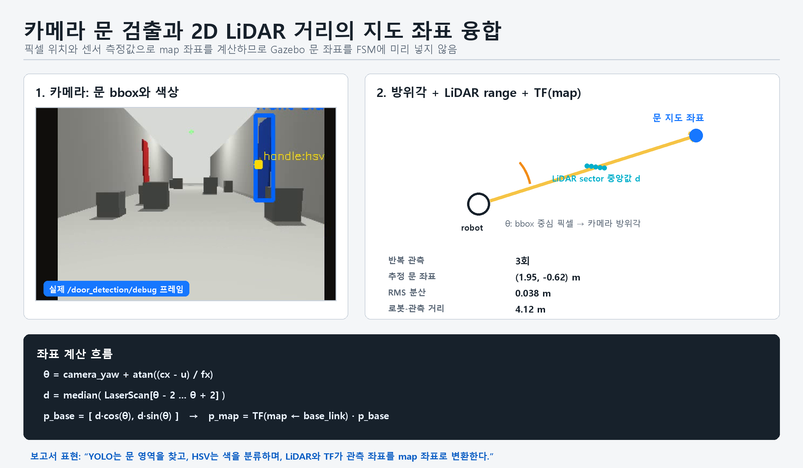

청록 LiDAR 점은 거리 센서의 공간 표본이다. 빨강·파랑·초록 문 점은 카메라에서 분류한 의미를 추정 위치에 붙인 관측 기록이다. 색 점 수는 문 개수가 아니며, 같은 문을 여러 번 보면 여러 점이 생길 수 있다.

### 2D 문 위치 계산의 기본 관계

설명용 의사코드
```python
p_scan = [range * cos(theta), range * sin(theta)]
p_map = T_map_scan(time) * p_scan
door_observation = {p_map, color, confidence, time}
```
거리와 방향을 같은 시점·같은 기준계로 맞춘다는 의미의 설명식. 실제 코드는 카메라별 TF, 거리 일치 검사, fallback 분기를 포함한다.

점이 흩어지는 원인은 픽셀 bbox 변화, 잘못 연결된 거리, 가림, TF/위치추정 오차 등이다. 그림만 보고 특정 원인 하나로 확정하지 않고 관측 시각·입력 방법·변환 프레임을 함께 기록한다.


## 11. 6a. 실제 색 관측 CSV의 누적 지도
World1 | 2026-09-16 보존 주행 자료를 이번 개정에서 재시각화

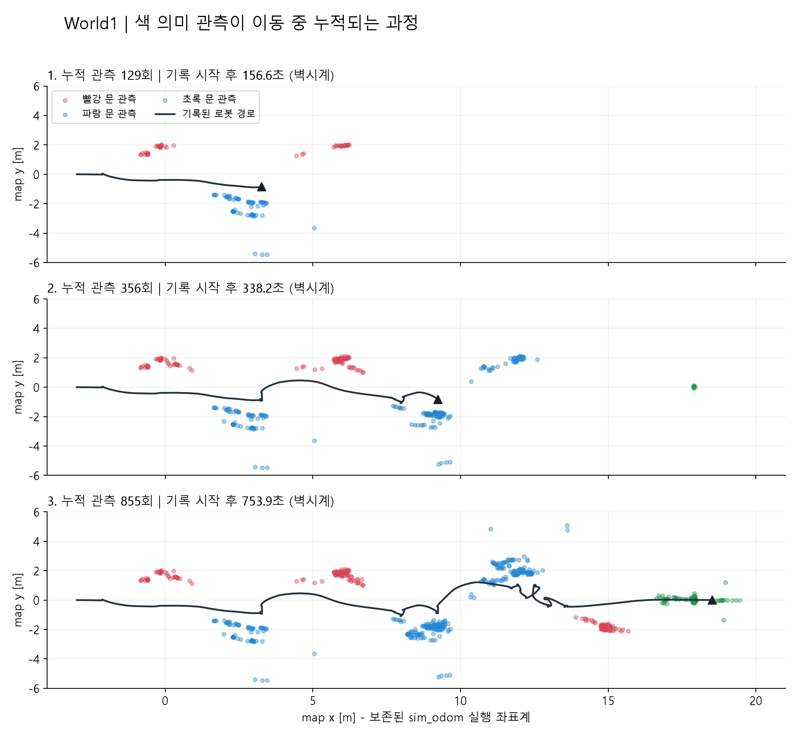

최종 기록은 파랑 407회·빨강 275회·초록 173회, 총 855회 관측이다. 이동하면서 의미 관측이 추가되는 모습과 흩어짐을 그대로 남겼다. y가 벽에서 벗어난 관측도 숨기지 않았다.

이 그림은 실측 관측 로그의 사후 표시다. 저장 지도+sim_odom 조건이며, 온라인 SLAM 전체 확장 또는 모든 점의 수렴 완료를 입증하는 그림이 아니다. 추정 좌표·주차 목표·실제 문 위치는 서로 다르다.


## 12. 7. 가까워지며 위치를 보완한다
좌표 안정성과 실제 정답 위치 정확도는 다른 주장이다

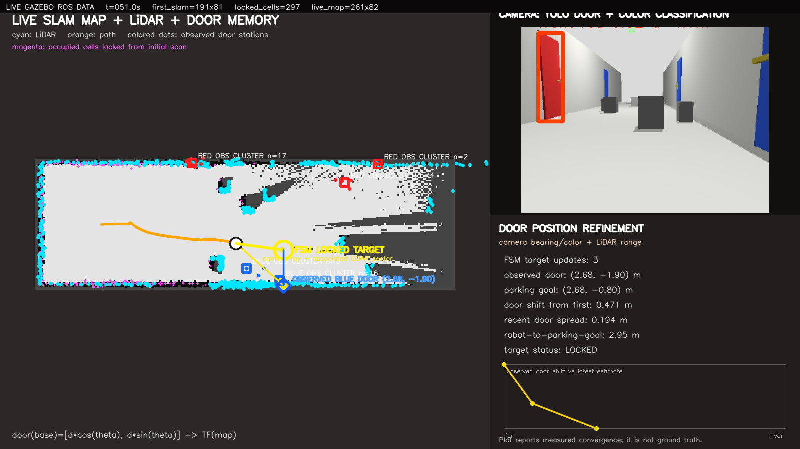

초기 의미 관측 화면에서는 n=3, RMS spread 0.341m가 표시된다. 이는 소수 관측의 흩어짐이며 위치 정답 오차가 아니다. 이후 목표가 잠기더라도 같은 문에 대한 새 관측으로 좌표를 보완할 수 있다.

### 완전 수렴을 주장하려면 추가로 필요한 것

충분한 유효 표본 수, 일정 시간의 작은 분산, 최근 관측 유지, 독립 기준면/실측 좌표와의 오차를 함께 제시해야 한다. 화면에서 update 1 또는 spread 0.000이 나와도 표본이 하나라면 수렴 증거가 아니다.

[영상: 첫 문 접근 중 관측 좌표 변화 (2026-09-09)](09_영상/08_첫문_좌표수렴_영상_browser_h264.mp4)

이 보고서는 “좌표가 관측으로 갱신되는 과정”을 증명하며, 모든 문이 오차 0으로 수렴했다는 표현은 사용하지 않는다.


## 13. 8. 문을 점이 아닌 작업 기억으로
position + color votes + status + last_seen

| 기억 항목 | 왜 필요한가 |
| --- | --- |
| x, y / count / confidence | 반복 관측을 하나의 공간 landmark로 요약 |
| blue_count, red_count, green_count | 단발 색 결과 대신 누적 관측으로 판단 |
| last_seen | 오래된 추정과 최근 관측을 구분 |
| opened / abandoned | 완료 문과 제한 횟수 이후 포기한 문을 구분 |
| door ID lineage / 물리 station | 회전·시점 변화로 ID가 바뀌어도 같은 문 연결 |
실제 코드: 08_코드발췌와원본/주행보존본/state_machine_node.py:2500-2507
```python
count = int(landmark.get('count', 0.0)) + 1
alpha = 1.0 / min(count, 8)
landmark['x'] = (1.0 - alpha) * float(landmark.get('x', xy[0])) + alpha * xy[0]
landmark['y'] = (1.0 - alpha) * float(landmark.get('y', xy[1])) + alpha * xy[1]
landmark['count'] = float(count)
landmark[f'{color}_count'] = float(landmark.get(f'{color}_count', 0.0)) + 1.0
landmark['confidence'] = max(float(landmark.get('confidence', 0.0)), float(door.confidence))
landmark['last_seen'] = now_sec
```
관측 횟수에 따라 위치를 갱신하고 색별 표 수와 마지막 관측 시각을 저장한다.

alpha = 1/min(count, 8)이므로 초기에는 평균처럼 반영하고, 이후에도 새 관측 가중치 1/8을 남긴다. 무한히 평균을 굳히지 않아 최신 관측을 반영할 수 있지만, 잘못된 관측을 완전히 없애는 통계적 보장은 아니다.

기억은 현재 프로세스의 임무 상태다. 재시작 후 자동 복원되는 영속 DB라고 주장하지 않는다. 관측·선택·처리 이력을 분리한 것이 핵심이다.


## 14. 9. 가장 가까운 미처리 문을 잠근다
다음 후보를 관측해도 현재 처리할 문이 수시로 바뀌지 않도록

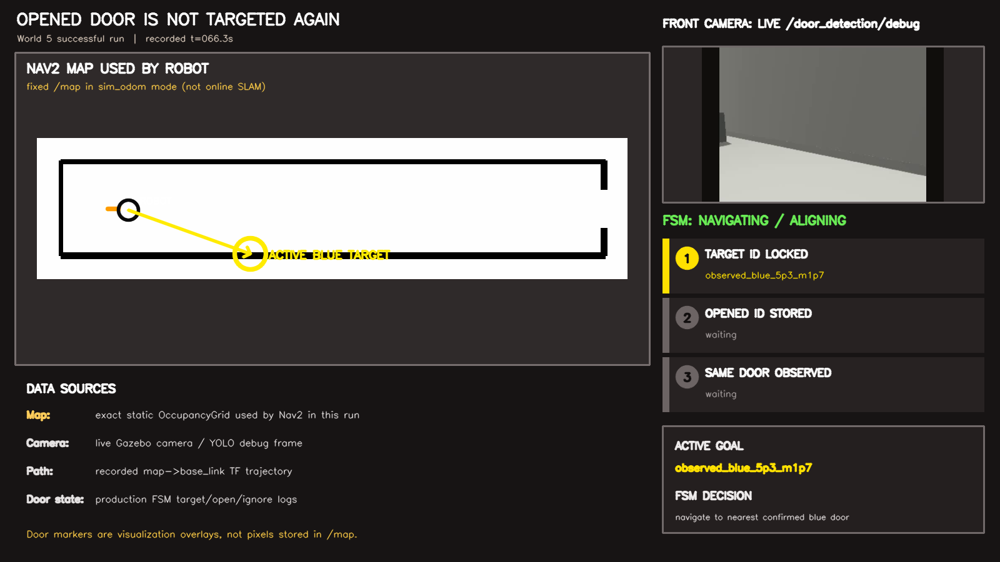

열리지 않았고, 포기 상태가 아니며, 관측 신뢰·색 충돌·공간 필터를 통과한 파란문 중 목표를 선택한다. 목표를 잠근 뒤 다른 후보는 기억에 남기되 현재 작업의 대체 목표로 즉시 쓰지 않는다.

현재 _nearest_forward_blue_door는 로봇 pose가 있으면 문 identity까지 유클리드 거리를 사용한다. 출구 근처 불확실 후보에는 우선순위 penalty가 있고, pose가 없으면 진행축 값을 사용한다. 따라서 “항상 경로 비용의 전역 최단 문”을 고르는 알고리즘은 아니다.

[영상: 목표 잠금 → 개방 기억 → 재관측 제외](09_영상/05_목표잠금_개방기억_영상_browser_h264.mp4)


## 15. 10. 열린 문을 기억하는 장면
2026-09-09 보존 자료 | World5 성공 기록 재구성

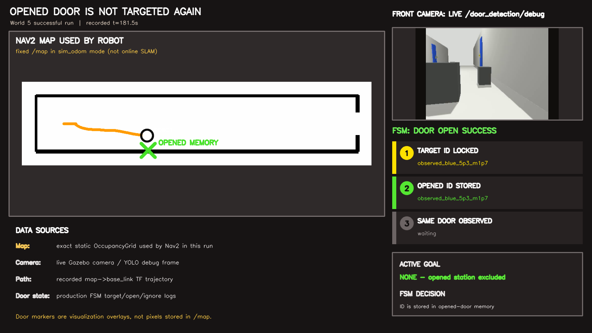

개방 결과를 받으면 ID 집합과 지도상 물리 station을 기록한다. 이후 개별 카메라가 새 ID를 발급하더라도 같은 위치/같은 벽면 관계라면 이미 처리한 문으로 연결할 수 있다.

### 중요한 구분

이 장의 “개방 완료”는 당시 주행 backend 결과다. 최신 PIPER 물리 접촉 성공 여부와는 별도다. 기억 로직의 동작을 보여주기 위해 보존했으며, 과거 장면을 새 r40 접촉 시험 장면으로 바꾸어 설명하지 않는다.

그림에 보이는 fixed map은 해당 sim_odom 실행에서 쓰인 저장 OccupancyGrid다. 앞의 live SLAM 확장 그림과 실행 조건이 다르다.


## 16. 11. 다시 봐도 목표로 삼지 않았다
동일 실행의 재관측 사건이 핵심 증거다

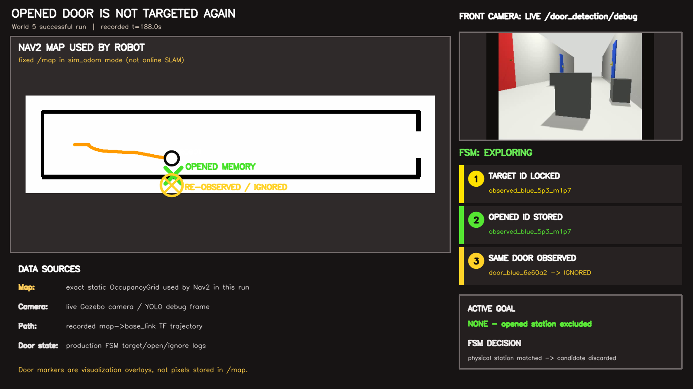

| 항목 | 기록 |
| --- | --- |
| 저장된 opened station | observed_blue_5p3_m1p7 |
| 다시 관측된 ID | door_blue_6e60a2 → IGNORED |
| 당시 상태 / 활성 목표 | EXPLORING / NONE |
ID가 달라졌는데도 같은 문으로 제외된 사례라는 점이 중요하다. 한 프레임에서 목표가 없다는 사실만이 아니라, 열린 station과 재관측 ID를 연결한 제외 기록이 증거다. 다만 이 한 사례가 모든 위치오차 상황의 재선택 방지를 보장하지는 않는다.


## 17. 12. 재선택 방지 실제 코드
관측 callback의 후보 등록 전에 완료 문을 차단한다

실제 코드: 08_코드발췌와원본/주행보존본/state_machine_node.py:1030-1042
```python
elif msg.door_color == 'blue':
    if self._is_door_opened_for_observation(msg):
        xy = self._door_identity_xy(msg)
        removed = self._discard_opened_blue_candidate_memory(msg)
        removed_text = (
            f' Stale same-ID candidate(s) removed: {removed}.'
            if removed > 0 else '')
        self.get_logger().info(
            f'Blue candidate {msg.door_id} ignored: physical/opened '
            f'door station already handled nearby at '
            f'({xy[0]:.2f}, {xy[1]:.2f}).{removed_text}',
            throttle_duration_sec=3.0)
        return
```
opened 판정을 먼저 하고 기존 중복 후보를 지운 뒤 return한다. 아래 신규 후보 등록까지 내려가지 않는다.

실제 코드: 08_코드발췌와원본/주행보존본/state_machine_node.py:2228-2239
```python
def _is_door_opened_for_observation(self, door: DoorInfo) -> bool:
    if door.door_color == 'blue' and self._door_has_map_identity(door):
        return (
            self._is_door_physically_opened(door)
            or self._is_blue_any_evidence_position_opened(door)
            or self._is_blue_same_id_opened_in_exit_tail(door)
            or self._is_blue_same_id_near_opened_station(door)
            or self._is_center_biased_opposite_projection_of_opened_blue(door)
        )
    if self._is_door_id_opened(door.door_id):
        return True
    return False
```
ID만 보는 것이 아니라 공간 station·관측 위치·투영 잔여 후보 관련 조건도 검사한다.

### 이 방식의 장점과 위험

장점: 카메라 방향이 바뀌어 ID가 변해도 중복 처리 방지가 가능하다. 위험: 병합 범위를 너무 크게 잡으면 가까운 다른 문을 이미 연 문으로 오인할 수 있다. 현재 코드는 위치·벽면 관계와 추가 필터를 사용하며, 이 병합 거리 역시 조정 가능한 휴리스틱이다.

문 개수를 미리 정해서 횟수만 채우는 구조와 다르다. 단, “휴리스틱이 전혀 없다”는 주장은 현재 코드와 맞지 않는다.


## 18. 12a. 최신 주행 로그에서도 재확인
2026-09-16 World5 | 원본 world5.log의 사건 순서

| 원본 라인 | 기록된 사건 | 의미 |
| --- | --- | --- |
| 513 | door_blue4, angle=2.1000, target=2.0944 | 그 backend에서 실제 문 모델 회전 확인 |
| 525~528 | door_blue_b177f7 개방 성공 → DOOR_OPENED → EXPLORING | opened 기록 후 다음 탐색 |
| 537 | door_blue_15a45f ignored: physical/opened door station | 다른 ID의 재관측도 처리 완료 station으로 제외 |
| 540~541 | YOLO handle observed (primary), conf=0.36 | 같은 주행 로그에 주 모델 손잡이 검출도 존재 |
재관측 제외 로그의 좌표는 (-0.55, 1.76)m다. 이 값은 해당 실행의 관측 위치이며 새 목표로 하드코딩해 넣은 값이 아니다. “이미 열었다”라는 기억이 후보 등록 전에 적용되었음을 보여준다.

### 함께 드러나는 사실

같은 구간에 HSV handle observed도 여러 차례 기록되어 있다. 그러므로 보존 주행이 매 프레임 v3 YOLO만으로 손잡이를 찾았다고 설명하지 않는다. 최신 r40은 주 모델 기원 관측을 요구하는 별도 조건이다.

[원본 로그 열기: World5 (라인 513~541)](07_원본판정/주행/월드5/world5.log)

이 사건을 예전 t=188.0초 영상의 동일 실행이라고 섞지 않는다. 두 날짜의 독립 증거가 같은 기억 정책의 동작을 보여준다.


## 19. 13. 처음 안 보이던 문도 기록한다
다음 문은 개방 직후에만 찾는 것이 아니다

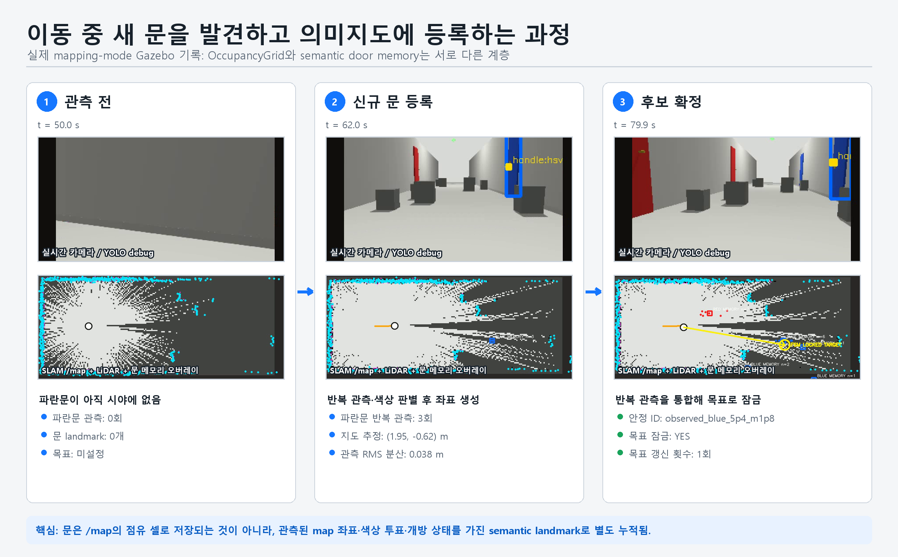

door_callback은 임무 상태와 별개로 관측을 기억에 반영한다. 현재 문으로 이동하는 동안에도 새 문 위치·색·신뢰도는 누적된다. 다음 단계에서는 새로 검색만 하는 것이 아니라 이미 쌓인 미처리 후보를 다시 평가한다.

열린 문 주변의 후보 제거와, 아직 열지 않은 이웃 문 보존이 동시에 필요하다. 같은 ID라도 위치가 멀면 다른 문인지 확인하고, 다른 ID라도 같은 색·근접 station이면 병합한다. 이 때문에 ID 문자열만 세는 방법보다 복잡하지만 관측 변화에 대응할 수 있다.

과거 지도 이미지·영상은 원본 그대로 제공한다. 이번 개정에서 모든 과거 녹화의 원 ROS bag을 재생한 것은 아니므로, 현재 코드 전체와 프레임 단위 일치한다고 확대하지 않는다.


## 20. 14. 장애물 회피의 실제 우선순위
안전 제약·탐색 편향·경로 추종은 서로 다른 층이다

| 층 | 현 구현 | 의도와 한계 |
| --- | --- | --- |
| 안전 / 실행 가능성 | scan·costmap·footprint·정지 조건 | 막힌 곳을 목표 선호 때문에 강행하지 않도록 검사 |
| 탐색 차선 선택 | 여유 거리 + 색상/장애물/차선 유지 점수 | 파랑 방향 선호, 빨강 쪽 회피, 좌우 흔들림 완화 |
| 목표 이동 경로 | SmacPlanner2D 비용 지도 계획 | 벽/장애물 비용을 피해 잠긴 목표로 이동 |
| 실시간 추종 | Rotation Shim + DWB + cmd_vel 안전 계층 | 방향 조정·속도 선택·필요한 정지/복구 |
현재 탐색 차선 정책은 “빨강에서 먼 쪽 무조건 1위, 파랑 쪽 무조건 2위” 같은 엄격한 순위표가 아니라 가중 점수와 상황별 분기다. 파란문 목표 Nav2 경로의 모든 점에 빨강 위험 비용이 직접 들어가는 것도 아니다.

설명용 의사코드
```python
score = observed_lane_clearance
score += blue_side_preference + red_avoidance_bias
score += obstacle_side_bias + keep_lane_bias
score -= short_clearance_penalty + recent_failure_penalty
choose_best_available_lane()
```
실제 점수식의 역할을 요약한 의사코드. 각 상황의 조기 반환과 세부 수치는 원본 _select_explore_goal_y에 있다.

따라서 보고서에는 “관측 여유 거리와 의미 편향을 함께 사용하는 회피 정책”으로 기술한다. 최적성·완전 무정지·빨간문 접근 절대 금지를 증명한 것으로 쓰지 않는다.


## 21. 15. 회피 점수와 비용 지도의 증거
관측한 장애물의 위치가 계획 비용으로 이어져야 한다

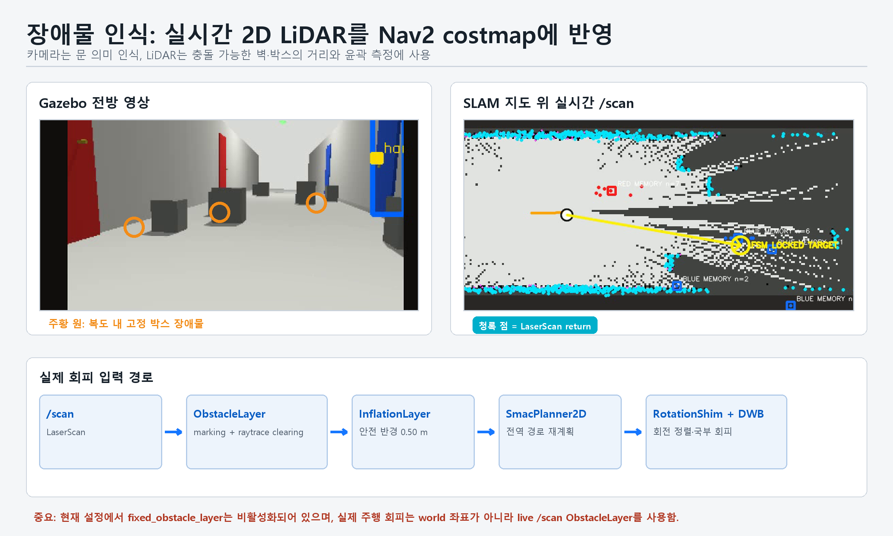

실제 코드: 08_코드발췌와원본/주행보존본/state_machine_node.py:18535-18541
```python
if red_avoid_sign != 0.0:
    if sign == red_avoid_sign:
        score += self._explore_nav_front_obstacle_bias_score * 0.90
    elif sign == -red_avoid_sign:
        score -= self._explore_nav_front_obstacle_bias_score * 1.20
    elif sign == 0.0:
        score -= 0.15
```
탐색 lane scoring의 빨강 반대 방향 보상과 빨강 쪽 감점. 함수 내 해당 점수 분기의 실제 코드.

이 수식의 가중치는 고정 정책 파라미터다. 관측 기반인 것은 입력되는 장애물 여유·문 방향이며, 점수 계수까지 센서에서 저절로 학습되는 것은 아니다. 경로 계획을 위해 별도의 YOLO식 planning 학습은 사용하지 않는다.

현재 costmap은 2D 스캔에 기반한다. 낮은 LiDAR가 보지 못하는 높이의 돌출물은 이 자료만으로 회피 보장이 되지 않는다. RGB가 물체를 봤다는 사실과 3D collision volume이 계획기에 들어갔다는 사실을 구분한다.


## 22. 16. Nav2 설정과 제어권
현재 보존 코드: SmacPlanner2D + Rotation Shim + DWB

| 구성 | 역할 | 현재 설정 예 |
| --- | --- | --- |
| SmacPlanner2D | global costmap 위 경로 계획 | cost_travel_multiplier 4.0 |
| Rotation Shim | 큰 방향 차이가 있으면 먼저 회전 | angular_dist_threshold 0.45 rad |
| DWB | 속도 후보 궤적을 평가해 local 추종 | min_vel_x 0.0 / max_vel_x 0.32 |
| 수동/조작 제어 | 정렬·예외 후진·팔 동작 시 Nav2와 분리 | 수동 제어 진입 전 목표 취소 요청 |
실제 코드: 08_코드발췌와원본/주행보존본/nav2_params.yaml:119-126
```python
FollowPath:
  plugin: "nav2_rotation_shim_controller::RotationShimController"
  primary_controller: "dwb_core::DWBLocalPlanner"
  angular_dist_threshold: 0.45
  forward_sampling_distance: 0.50
  rotate_to_heading_angular_vel: 0.65
  max_angular_accel: 2.0
  simulate_ahead_time: 1.0
```
Pure Pursuit가 아니라 Rotation Shim이 DWB를 감싸는 현재 설정이다.

실제 코드: 08_코드발췌와원본/주행보존본/state_machine_node.py:3756-3762
```python
def _request_navigation_cancel_for_manual_control(self, reason: str):
    msg = Bool()
    msg.data = True
    self.nav_cancel_pub.publish(msg)
    self.get_logger().info(
        f'Nav2 goal cancellation requested before {reason}.',
        throttle_duration_sec=1.0)
```
Nav2와 정렬/조작이 동시에 서로 다른 속도를 내지 않게 제어권 전환을 요청한다.

일반 전진 주행과 필요한 예외 후진을 분리했다. 이 값과 예외 처리가 있다는 사실은 “경로가 한 번도 멈추지 않는다”는 보장이 아니다. 센서 대기·목표 변경·정렬·복구는 정지를 만들 수 있다.


## 23. 17. 문 앞 정렬을 어떻게 읽는가
주행 주차 pose와 팔이 잡을 수 있는 pose는 구분한다

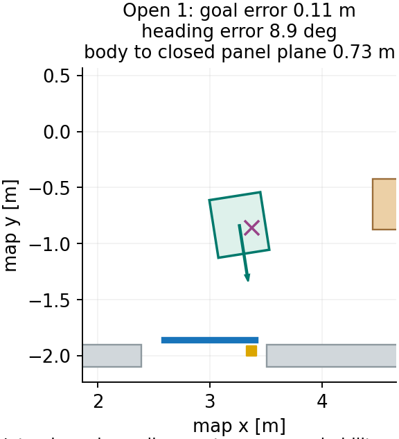

정렬은 목표 위치 오차와 방향 오차를 줄여 문 쪽을 향하게 하는 단계다. 하지만 Nav2 goal에 도착했다는 사실만으로 손잡이에 손이 닿거나 실제 문 법선과 완벽히 일치한다고 판정할 수 없다.

| 실측 범위 | 정확한 의미 |
| --- | --- |
| World1 첫 문: 차체 외곽-닫힌 문판 약 0.734m | 주행 정렬 결과. 30cm 이내 접촉 준비 완료라는 뜻 아님 |
| World1 첫 문: 문 법선 대비 약 8.91도 | “정면 방향”을 지향하지만 수학적으로 완전 일자는 아님 |
| 최신 단일문: 추가 IK 기반 접근 | 관측 손잡이를 실제 PIPER 작업공간으로 가져오는 별도 단계 |
현재 자료의 개선점을 숨기지 않고, 주행 정렬 검증과 팔 작업공간 접근 검증을 분리한 것이 설명의 핵심이다.


## 24. 18. 하드코딩에서 무엇이 바뀌었나
좌표를 얻는 방식·동작 종료 기준·남은 상수를 나누어 비교

| 항목 | 기존/남아 있는 계산 경로 | 현재 단일문 관측·피드백 경로 |
| --- | --- | --- |
| 손잡이 위치 | bbox + 추정 높이/거리 또는 side-wall projection | 주 YOLO 기원 픽셀 + 등록 depth + TF |
| 팔 접근 | 미리 정한 approach/offset·단계 pose | 관측 손잡이와 실제 PIPER IK/Jacobian 조건으로 접근 |
| 레버 누름 | 설정 거리만큼 누름 명령 | 작은 단계 이동 후 레버 반응·FK 추종 오차 확인 |
| 문 개방 | 주행 backend에서 모델 매칭 후 hinge 명령 | 손잡이 유지, 팔·본체 명령, 문 각도 결과 확인 |
| 완료 판단 | 서비스 성공/대기만으로 판단할 위험 | 신선한 레버/문 각도·접촉 감사·복귀 계측 결합 |
이 비교는 현재 보존 코드의 기존 경로와 분리 복사본의 r40 실행 경로를 비교한 것이다. 모든 과거 버전이 동일했다는 뜻이나, r40이 월드 1~5에 이미 통합되었다는 뜻은 아니다.

### 여전히 필요한 상수

로봇 치수·관절 제한·센서 보정값·제어 이득·충돌 여유·최대 누름량·timeout·개방각 기준은 남는다. “관측 기반”의 핵심은 매번 얻는 목표/반응을 사용한다는 것이지 숫자를 코드에서 없애는 것이 아니다.


## 25. 19. 의심했던 벽 투영을 정확히 설명
max_abs_y / sin(angle)는 실측 wall_y가 아니다

실제 코드: 08_코드발췌와원본/주행보존본/door_detection_node.py:1919-1931
```python
max_abs_y = self._side_handle_max_abs_y
if max_abs_y <= 0.0 and self._nav_goal_max_abs_y > 0.0:
    max_abs_y = self._nav_goal_max_abs_y + self._side_door_standoff
if max_abs_y <= self._side_door_min_abs_y:
    return None

sin_a = math.sin(angle)
if abs(sin_a) < 1e-3:
    return None
dist = max_abs_y / abs(sin_a)
forward = dist * math.cos(angle)
if forward <= 0.20 or dist > self._max_detection_distance:
    return None
```
_side_wall_projected_distance의 실제 계산. 설정된 가로 거리 밴드와 방위각으로 거리를 추정한다.

이 경로가 켜져 있으면 “LiDAR가 벽 위치를 실측했다”라고 설명하면 안 된다. max_abs_y는 파라미터이며, 함수 이름/주석만으로 관측 값이라고 해석할 수 없다.

실제 코드: 08_코드발췌와원본/주행보존본/simulation.launch.py:451-453
```python
'side_wall_projection_enabled': False,
'side_wall_projection_min_abs_angle_deg': 35.0,
'side_wall_projection_min_extend_m': 0.35,
```
현재 보존 simulation.launch에서는 이 경로를 비활성화했다. 모든 과거 실행이나 다른 launch에도 자동 적용되는 것은 아니다.

다른 범위 제한·목표 standoff·기본 손잡이 높이·후보 병합 파라미터는 주행 baseline에 남아 있다. 최신 단일문 registered_depth 경로는 유효 depth가 없을 때 벽/높이 추정으로 성공시키지 않고 관측을 거부한다.

### 발표 문장

“기존에는 일부 좌표를 설정된 벽 밴드로 보완했지만, 현재 단일문 실험에서는 YOLO와 등록 깊이의 3D 관측을 사용하며 데이터가 없으면 진행하지 않도록 분리했다.”


## 26. 20. 손잡이 픽셀이 실제 목표 좌표로
등록 RGB-D + 카메라 보정 + TF

실제 코드: 08_코드발췌와원본/접촉복사본/door_detection_node.py:1595-1610
```python
patch = depth[y-2:y+3, x-2:x+3]
values = patch[np.isfinite(patch) & (patch > .1) & (patch < 5.0)]
if len(values) < 15 or float(np.ptp(values)) > .04:
    return reject('invalid or discontinuous depth at handle pixel')
z = float(np.median(values))
point = PointStamped()
point.header = rgb_header
point.point.x = (x - source.cx) * z / source.fx
point.point.y = (y - source.cy) * z / source.fy
point.point.z = z
try:
    base = self._tf_buffer.transform(
        point, self._frame, timeout=rclpy.duration.Duration(seconds=.1))
except Exception as exc:
    return reject(f'camera TF: {exc}')
return (base.point.x, base.point.y, base.point.z)
```
bbox 중심의 5×5 깊이 patch를 검사하고 중앙값을 카메라 광학 좌표로 역투영한 뒤 기준 프레임으로 변환한다.

| 검사 | 필요한 이유 |
| --- | --- |
| RGB-depth 시각 차이·영상 크기·보정값 | 다른 픽셀/다른 시점의 깊이를 붙이지 않기 |
| 유효 깊이 수 / patch 깊이 불연속 | 손잡이와 뒤 문판이 섞인 경계를 무턱대고 채택하지 않기 |
| 카메라 TF 변환 | 픽셀 위치와 로봇팔 기준 좌표를 혼동하지 않기 |
이 점은 눈에 보이는 손잡이 표면점이다. 손잡이의 정확한 회전축·접촉면·재질·힘까지 검출한 것은 아니다. 실제 RGB-D에서는 정합 오차와 금속 반사/깊이 누락을 별도 검증해야 한다.


## 27. 21. 얼마나 다가갈지는 IK로 확인
최신 r40 | 관측 좌표 + 교정된 PIPER 크기와 관절 제한

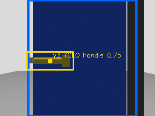

| r40 계측 | 값 |
| --- | --- |
| 초기 관측 base_link XYZ | (1.120, 0.249, 0.767) m |
| 접근 후 채택 XYZ | (0.666, 0.146, 0.766) m |
| 실제 추가 접근 이동 | 약 0.468m |
| IK condition ratio / 기준 | 0.2701 / 0.25 |
이번 실행은 “항상 0.468m 앞으로 가라”라는 명령이 아니다. 관측한 손잡이를 기준으로 실제 링크 길이·관절 한계·IK 조건을 확인해 접근했고, 표의 이동량은 실행 후 계측 결과다. 로봇 치수와 condition 기준은 고정 교정/안전 설정으로 남는다.


## 28. 22. 얼마나 누를지는 반응을 본다
설정 최대량과 실제 멈추는 조건을 구분

실제 코드: 08_코드발췌와원본/접촉복사본/physical_contact_manipulation_node.py:2085-2089
```python
stable = stable_lever_motion(
    recent, began, initial, cfg['press_sign'],
    self._sim_lever_press_min_angle)
if stable:
    self._feedback_press_verified = True
```
최근 레버 반응이 최소 기준을 안정적으로 충족하면 press_verified로 전환하고 추가 깊이를 늘리지 않는다.

실제 코드: 08_코드발췌와원본/접촉복사본/physical_contact_manipulation_node.py:2110-2118
```python
try:
    next_depth, pending = next_press_depth(
        depth, cfg['press_step_m'], cfg['press_max_travel_m'],
        initial, lever, cfg['press_sign'], self._sim_lever_press_min_angle)
except ValueError as exc:
    return self._feedback_stop(str(exc))
if pending:
    time.sleep(0.025)
    continue
```
아직 반응이 부족하면 작은 단계의 다음 깊이를 계산하되 최대 이동 한계와 오류 처리를 적용한다.

| r40 누름 사건 | 값과 해석 |
| --- | --- |
| commanded_depth_m | 0.020m: 이번 실행에서 쌓인 명령 깊이 |
| measured_tool_down_m | 0.01161m: FK로 측정한 실제 공구 하강 |
| lever_delta_rad | 0.09725rad, 약 5.57도에서 누름 확인 |
명령 깊이와 실제 움직임은 같지 않다. 위치 servo가 부하를 유지하려면 잔여 오차가 필요하므로 안정 확인 후 기존 목표를 유지한다. 레버 반응이 없거나 추종 오차가 과하면 더 밀어 성공 처리하지 않고 중단한다.

현재 반응은 Gazebo 레버 joint state다. 실물에서는 엔코더/접촉·힘/시각 피드백으로 대체해야 한다.


## 29. 23. 손잡이 YOLO는 무엇이 달라졌나
기존 v2는 보조, 혼합 학습 v3를 주 모델로 사용

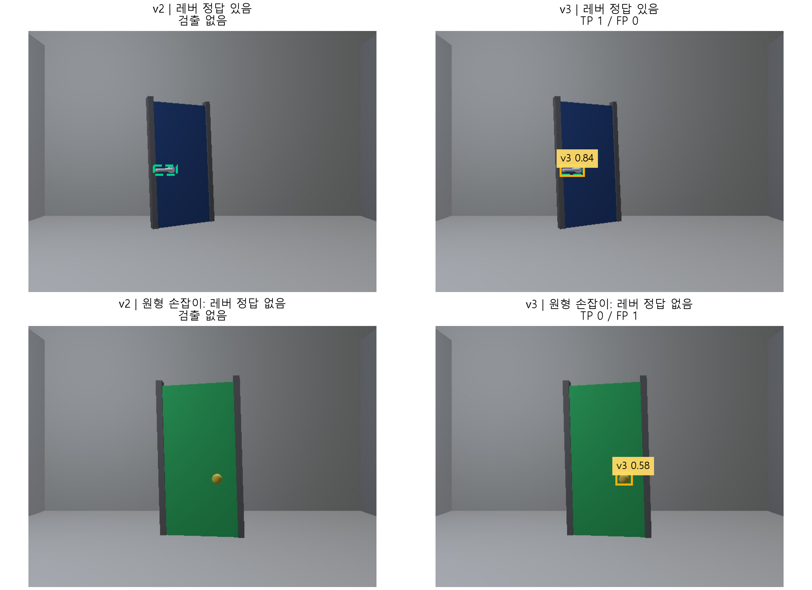

팀원은 실제 레버 데이터와 Gazebo 레버 데이터를 섞어 v2에서 추가 학습했다. v3는 시뮬레이션 외형과 도메인 차이를 줄이는 데 효과가 있었지만 실제 데이터의 기준을 통과하지 못해 CANDIDATE 명칭을 유지했다.

런타임은 주 모델 검출을 먼저 사용하고 설정에 따라 보조 모델/추적/HSV 경로를 가질 수 있다. 따라서 한 장의 bbox가 보인다고 모든 시점이 주 YOLO 직접 검출이었다고 주장하면 안 된다.

| 최신 r40 기록 | 의미 |
| --- | --- |
| use_yolo_observation = true / primary 요구 | 주 모델 기원 관측이 필요 |
| yolo_observation_count = 38 | 실행 중 기록된 주 모델 기원 관측 수 |
| track:primary_yolo:lk:registered_depth | 최종 채택은 YOLO에서 시작한 LK 추적 + 등록 깊이 |

## 30. 24. 인식 효과를 숫자로 말하기
고정 threshold의 사후 짝비교, 실시간 성공률과는 다르다

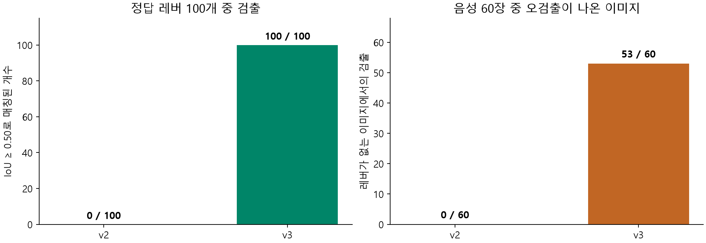

| 지표 | v2 | v3 |
| --- | --- | --- |
| TP / FP / FN | 0 / 0 / 100 | 100 / 54 / 0 |
| Recall | 0% | 100% |
| Precision | 예측 없음 | 64.9% |
| 오탐이 있는 negative 이미지 | 0 / 60 | 53 / 60 |
해석: Gazebo 손잡이를 놓치는 문제는 이 표본에서 크게 개선됐지만, 배경 오탐이 남는다. “99%니까 완벽” 대신 문 ROI·시간 추적·depth 정합·조작 전 신선도 검사와 함께 쓴다는 점을 강조한다.

팀원 전달 실제 데이터 Recall은 약 0.4091로 부족하다. 문 Door 모델 전달 지표는 mAP50 0.6088, Precision 0.6184, Recall 0.5817이다. 서로 다른 데이터셋/평가 조건의 숫자를 같은 성능으로 직접 비교하지 않는다.


## 31. 25. 월드 1~5 주행 결과 요약
2026-09-16 보존 자료 | 같은 입력 해시 확인, 물리 팔 FULL은 아님

| 월드 | 구성 | 개방 사건 | 경로 m | 중첩 시료 |
| --- | --- | --- | --- | --- |
| 1 | 혼합 문·밀집 장애물 | 3 | 31.73 | 0 |
| 2 | 대체 문·장애물 배열 | 3 | 28.89 | 0 |
| 3 | 파란문 4개 | 4 | 29.81 | 0 |
| 4 | 파란문 없음 | 0 | 33.13 | 0 |
| 5 | 좌우 파란문 6개 | 6 | 31.97 | 0 |
5개 월드 모두 보존 checker 집계의 runner/checker/attitude/events/exclusion/geometry 반환값 0, mission_complete. World1·2는 r9, World3·4·5는 r8 자료이며 manifest로 런타임·검사 입력의 같은 해시를 확인했다.

### 무엇을 증명했는가

저장 지도와 sim_odom 위치추정 조건에서 관측 문 후보 선택·이동·주행 정렬·처리 사건·다음 문·출구 도달이 완료됐다. 그림의 장애물 위치/크기는 사후 SDF 참조이며 검은 선은 실제 기록된 이동이다.

### 무엇을 증명하지 않았는가

새 r40 접촉 로봇팔로 16개 문을 모두 연 통합 임무, 미지 환경의 완전 SLAM, 실제 로봇의 충돌·접촉 안전성은 아니다. 샘플링 footprint 중첩 0도 연속 시간 전체의 무충돌 보장과 다르다.

정답 문 수 3·3·4·0·6은 검증용 수치다. 같은 숫자를 FSM의 사전 문 개수로 공급해 순서대로 방문했다는 의미가 아니다.


## 32. 26.1 World 1 | 주행 PASS
혼합 문·밀집 장애물 | 보존 실행 2026-09-16


| 검사 | 결과 |
| --- | --- |
| 고유 파란문 처리 사건 / 정답 수 | 3 / 3 |
| 누적 경로 / pose 시료 | 31.73m / 2155개 |
| 샘플링 차체-장애물 중첩 | 0 |
| 종료 | MISSION_COMPLETE / 검사 반환값 0 |
사후 닫힌 문판 기준 차체 외곽 거리 0.608~0.764m. 문 법선 대비 자세 오차 7.37~12.55도. 이는 주행 자세 검사이며 파지 성공률이 아니다.

문 접근·후퇴·다음 목표 방향 전환이 겹쳐 궤적이 일부 휘거나 교차한다. 이 한 그림만으로 모든 꼬임을 정상 동작으로 단정하지 않는다. 총 임무 성공과 경로의 간결함은 별도 평가 대상이다.

[원본 지표: World1](07_원본판정/주행/월드1/mission_evidence_final_metrics.json)


## 33. 26.2 World 2 | 주행 PASS
대체 문·장애물 배열 | 보존 실행 2026-09-16


| 검사 | 결과 |
| --- | --- |
| 고유 파란문 처리 사건 / 정답 수 | 3 / 3 |
| 누적 경로 / pose 시료 | 28.89m / 1735개 |
| 샘플링 차체-장애물 중첩 | 0 |
| 종료 | MISSION_COMPLETE / 검사 반환값 0 |
사후 닫힌 문판 기준 차체 외곽 거리 0.609~0.825m. 문 법선 대비 자세 오차 2.24~8.66도. 이는 주행 자세 검사이며 파지 성공률이 아니다.

문 접근·후퇴·다음 목표 방향 전환이 겹쳐 궤적이 일부 휘거나 교차한다. 이 한 그림만으로 모든 꼬임을 정상 동작으로 단정하지 않는다. 총 임무 성공과 경로의 간결함은 별도 평가 대상이다.

[원본 지표: World2](07_원본판정/주행/월드2/mission_evidence_final_metrics.json)


## 34. 26.3 World 3 | 주행 PASS
파란문 4개 | 보존 실행 2026-09-16

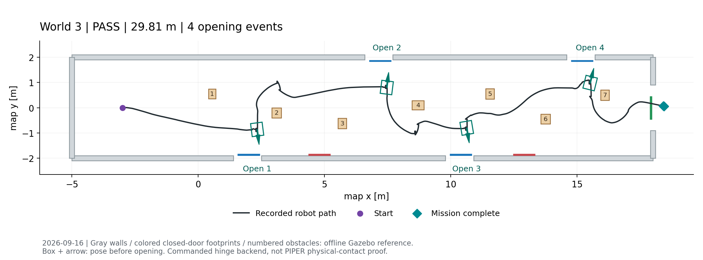

| 검사 | 결과 |
| --- | --- |
| 고유 파란문 처리 사건 / 정답 수 | 4 / 4 |
| 누적 경로 / pose 시료 | 29.81m / 1952개 |
| 샘플링 차체-장애물 중첩 | 0 |
| 종료 | MISSION_COMPLETE / 검사 반환값 0 |
사후 닫힌 문판 기준 차체 외곽 거리 0.576~0.772m. 문 법선 대비 자세 오차 7.17~13.88도. 이는 주행 자세 검사이며 파지 성공률이 아니다.

문 접근·후퇴·다음 목표 방향 전환이 겹쳐 궤적이 일부 휘거나 교차한다. 이 한 그림만으로 모든 꼬임을 정상 동작으로 단정하지 않는다. 총 임무 성공과 경로의 간결함은 별도 평가 대상이다.

[원본 지표: World3](07_원본판정/주행/월드3/mission_evidence_final_metrics.json)


## 35. 26.4 World 4 | 주행 PASS
파란문 없음 | 보존 실행 2026-09-16

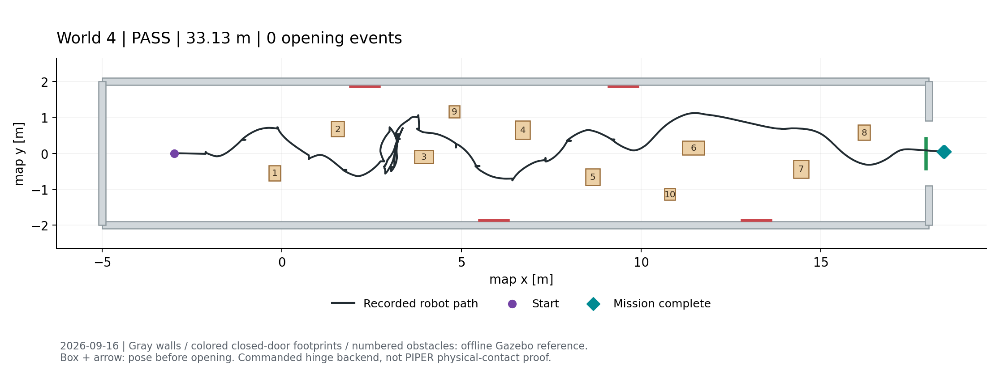

| 검사 | 결과 |
| --- | --- |
| 고유 파란문 처리 사건 / 정답 수 | 0 / 0 |
| 누적 경로 / pose 시료 | 33.13m / 1853개 |
| 샘플링 차체-장애물 중첩 | 0 |
| 종료 | MISSION_COMPLETE / 검사 반환값 0 |
파란문이 없는 경우: 파란 작업 0회를 정상으로 받아들이고 탐색·출구 정책으로 종료한다. 로봇에게 “0개”를 미리 알려주고 파란문 검색을 건너뛴다는 뜻이 아니다. 이 경로의 흔들림은 보존 자료에 그대로 남겼다.

[원본 지표: World4](07_원본판정/주행/월드4/mission_evidence_final_metrics.json)


## 36. 26.5 World 5 | 주행 PASS
좌우 파란문 6개 | 보존 실행 2026-09-16

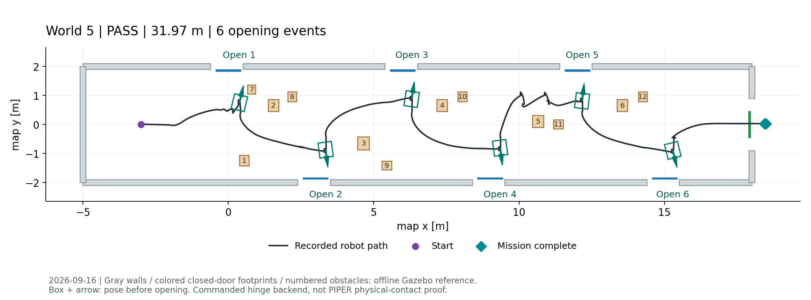

| 검사 | 결과 |
| --- | --- |
| 고유 파란문 처리 사건 / 정답 수 | 6 / 6 |
| 누적 경로 / pose 시료 | 31.97m / 2498개 |
| 샘플링 차체-장애물 중첩 | 0 |
| 종료 | MISSION_COMPLETE / 검사 반환값 0 |
사후 닫힌 문판 기준 차체 외곽 거리 0.652~0.809m. 문 법선 대비 자세 오차 6.85~14.01도. 이는 주행 자세 검사이며 파지 성공률이 아니다.

문 접근·후퇴·다음 목표 방향 전환이 겹쳐 궤적이 일부 휘거나 교차한다. 이 한 그림만으로 모든 꼬임을 정상 동작으로 단정하지 않는다. 총 임무 성공과 경로의 간결함은 별도 평가 대상이다.

[원본 지표: World5](07_원본판정/주행/월드5/mission_evidence_final_metrics.json)


## 37. 27. 주행 성공과 경로 품질을 분리
임무 완료 ≠ 최단 경로 ≠ 정렬 완벽 ≠ 실물 검증

| 관찰 | 현재 확인된 사실 | 다음 평가 |
| --- | --- | --- |
| 문 근처 작은 루프 | 기록 궤적에 실제 남아 있음 | 목표 갱신·후진·선회 사건과 시각 맞춰 원인 분리 |
| 주행 중 정지 | 정렬·센서대기·복구 등이 가능 | 정지시간, 계획시간, 재계획 횟수 정량화 |
| 정면 주차 | 문 쪽 자세로 접근했으나 각도 오차 존재 | 실제 문 법선/손잡이 작업공간 기준 오차 추가 |
| 문 모델 회전 | 주행 backend 회전 확인 | 신규 접촉 backend 연결 후 전체 재시험 |
### 기존 성공 자료를 남기는 이유

주행 보존본이 있으면 로봇팔 통합 후 문제를 주행 회귀와 조작 문제로 나누어 확인할 수 있다. 이번 보고서는 주행 성공을 폐기하지 않되, 새 물리 팔 성공으로 재해석하지 않는다.

### headless와 GUI

GUI가 없어도 물리·센서·노드가 실행되는 headless 시험은 유효하다. GUI·녹화는 관찰과 부하 조건을 추가한다. 화면이 있다는 것 자체가 더 엄격한 정책 증명은 아니며, 타이밍·센서 신선도·부하 변화는 별도 조건으로 기록해야 한다.


## 38. 28. 최신 단일문 개방의 전체 순서
r40 | 실제 PIPER 링크 형상과 접촉을 사용한 별도 fixture


문을 몸통으로 밀거나 손잡이를 놓은 상태에서 팔을 늘려 여는 방식이 아니다. 손을 하중 전달 경로로 유지하고, 본체 이동/선회와 팔 자세 보정을 함께 수행한다. 팔 관절을 완전히 고정한 채 전진만 하는 방식도 아니다.

[최신 영상: 손잡이 유지 개방·복귀 요약 (녹화 기준 6배속)](09_영상/05_최신_r40_손잡이유지개방_요약6x.mp4)

약 34초 요약은 녹화 프레임의 6배속이다. 센서 렌더 수신률과 기록 주기가 달라 시뮬레이션 실시간 배속을 뜻하지 않는다. 프레임 보간·생성 이미지는 사용하지 않았다.


## 39. 29. 파지한 뒤 레버를 눌렀다
r40 t=64.5초 렌더 + t=64.897초 측정 사건

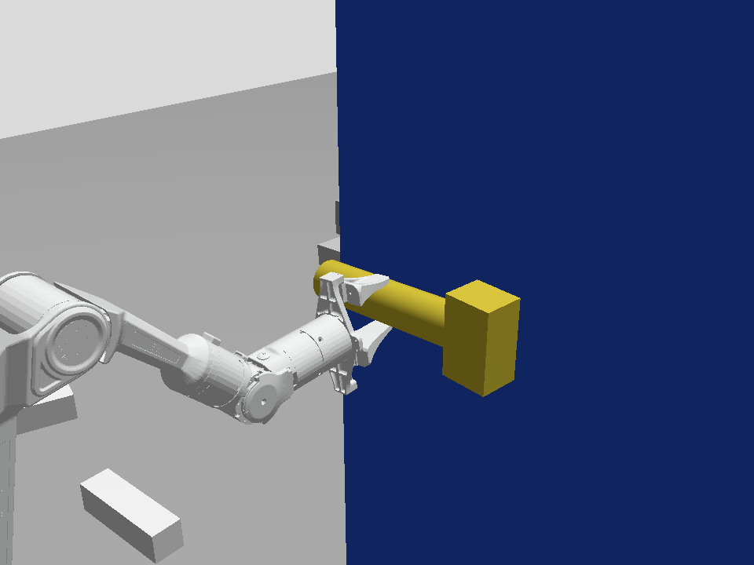

| 근거 | 기록 |
| --- | --- |
| press_verified | sim_time 64.897s |
| 레버 변화 | 약 5.57도 |
| 명령 하강 / 측정 하강 | 20.0mm / 11.61mm |
| 피드백 출처 | Gazebo joint states + 팔 관절 FK |
그림은 접촉의 시각적 맥락이고, 누름 판정은 로그로 확인한다. 실제 레버가 잠금장치를 해제하는 데 필요한 각도/토크는 문마다 다르므로 이 fixture의 기준을 그대로 현장 표준으로 쓸 수 없다.


## 40. 30. 손잡이를 유지하며 본체 이동
r40 중간 개방 장면 | 완전 고정 팔보다 접촉 자세 유지가 중요

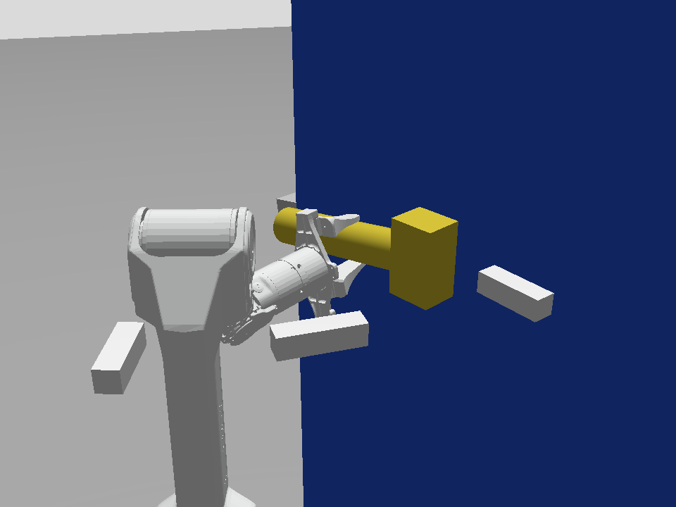

문은 경첩을 중심으로 원호 운동을 한다. 본체가 직선으로만 전진하고 팔을 완전히 고정하면 손잡이의 원호와 손의 경로가 달라져 미끄러짐·과부하가 생길 수 있다. 현재 구현은 관측된 접촉 자세·문/본체 방향 차이를 보고 선속도·각속도와 팔 목표를 보정한다.

문이 정지하거나 레버가 풀리거나 손가락/관절 상태가 유효하지 않으면 중단한다. 문을 붙잡는 가상의 weld joint를 붙이거나 문 hinge 위치 명령을 직접 보내 개방한 시험이 아니다.

result.json: attach_grasp_joint=false, door_hinge_command_topic_used=false, arm_joint_commands_used=true, mobile_base_commands_used=true.


## 41. 31. 손잡이를 놓기 전에 목표각 도달
r40 개방 확인 사건 | 관측 피드백 기반 전이

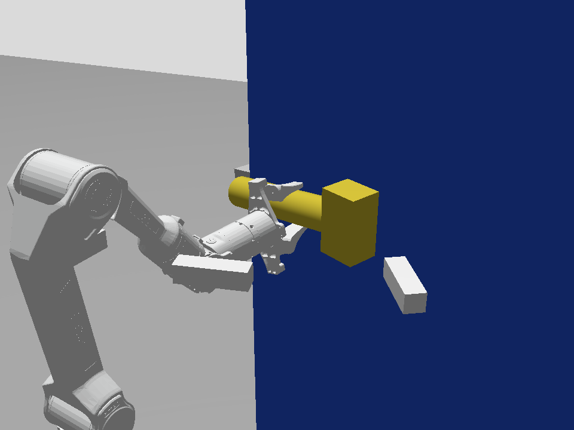

실제 코드: 08_코드발췌와원본/접촉복사본/physical_contact_manipulation_node.py:2739-2742
```python
if delta >= min_delta:
    self._feedback_event('handle_held_open_verified', door_delta_rad=delta,
                         lever_delta_rad=lever, actual_tool_xyz=actual.tolist())
    return True
```
측정 문 각도가 기준을 넘은 뒤에 handle_held_open_verified를 남기고 다음 해제 단계로 간다.

| 사건 | 실측 |
| --- | --- |
| 손잡이 유지 개방 확인 | t=193.189s / 117.72도 |
| 요구 각도 / 최종 최대 | 117.46도 / 117.76도 |
| 동시 레버 변화 | 8.87도 |
완전 개방의 뜻은 이 시험에서 설정한 최소 2.05rad 도달이다. 모든 실제 문의 기계적 끝점에 닿았다는 의미는 아니다.


## 42. 32. 고정 시점에서 본 개방 전후
추적 closeup의 시각적 착시를 고정 overhead로 보완

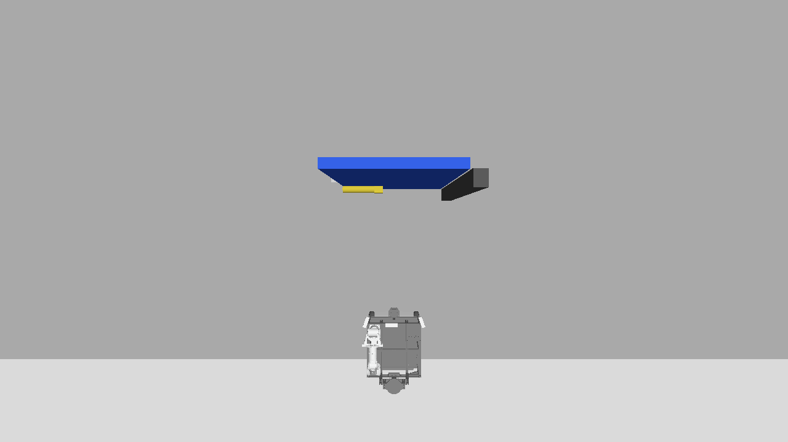

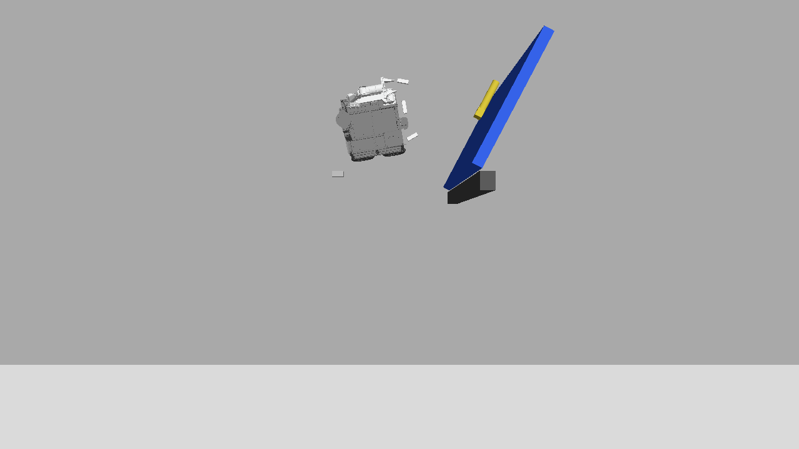

최신 모델은 측면 힌지 fixture다. 손잡이는 힌지에서 떨어진 문판 쪽에 있고, 본체/팔은 손잡이를 통해 미는 방향으로 개방한다. 위·아래 영상에서 카메라가 바뀐 것처럼 보이는 closeup과 달리, 이 두 장은 고정 시점의 전후 비교다.

방향은 카메라 시점만으로 “오른쪽/왼쪽”이라고 외우기보다 문 힌지 기준으로 설명한다. 로그에서 열린 방향 각도는 음수이며, 판정은 초기값 대비 절대 변화량을 사용한다.


## 43. 33. 개방각과 레버 반응의 계측
r40 feedback_events를 시뮬레이션 시간으로 다시 그림

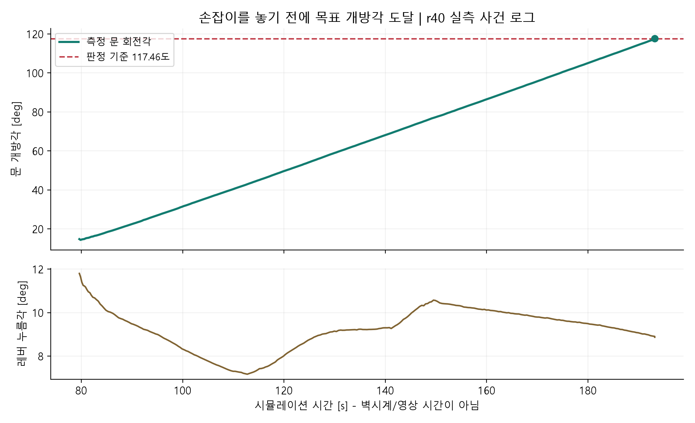

상단은 문 회전이 진행되어 117.46도 기준을 넘는 과정을 보여준다. 하단은 같은 구간의 레버 반응이다. 영상·서비스 응답만이 아니라 물리 상태를 함께 확인한다.

이 그래프는 Gazebo joint 계측이며 실물 힘/토크 센서 데이터가 아니다. 시간축은 simulation seconds다. 기존 door_hinge_angle.png의 wall-clock 시간축과 혼동하지 않는다.


## 44. 34. 개방 후 해제·회수·후진까지
성공 문을 연 뒤 다음 주행을 위한 자세로 돌아오는 단계

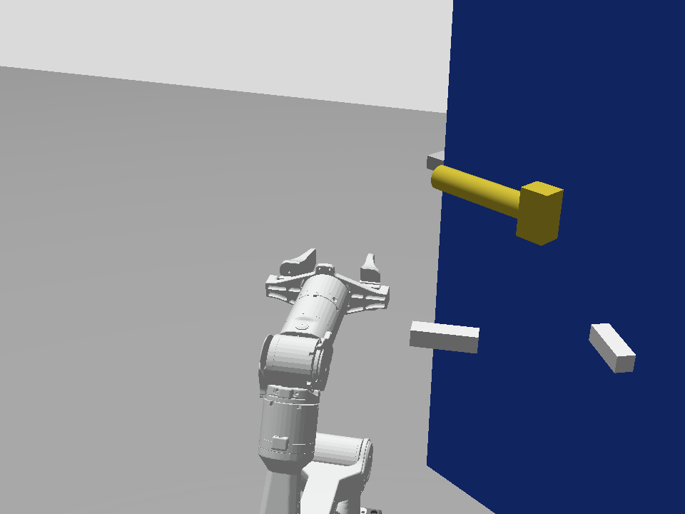

| 복귀 검사 | 결과 |
| --- | --- |
| 실제 후진 이동 | -0.2856m / 2.856 sim s |
| 최종 stow 최대 관절 오차 | 0.0193rad (기준 0.070rad) |
| 복귀 접촉 감사 | 금지된 문판/문틀 접촉 검사 PASS |
현재 후진 제어는 설정 속도와 시뮬레이션 시간으로 실행하고, 그 결과를 odom으로 확인한다. 따라서 이 단계까지 이동 거리 피드백 제어로 완전히 바뀌었다고 설명하지 않는다.

[영상: r40 전체 기록 (원 녹화 프레임 속도, H.264)](09_영상/06_최신_r40_손잡이유지개방_전체기록.mp4)


## 45. 35. 접촉 성공을 어디까지 믿을 수 있나
시각 자료 + 상태 계측 + 금지 접촉 검사 + 입력 보존

| 근거 | r40 결과 |
| --- | --- |
| 목표 개방·레버 피드백 | PASS |
| 손가락-레버 접촉 기록 | 4,654개 기록 |
| 본체/카메라/팔-문판/문틀 금지 접촉 | 검사 범위에서 미검출 |
| 접촉 기록 생존 확인 | 5채널 각 4,080메시지, 저장 최대 간격 0.15sim s |
| 팔 회수·후진 | 실제 관절/odom 후검사 PASS |
| 입력·단위검증 | 보존 기록: 212 tests, colcon 8 packages PASS |
r39는 실제 개방/복귀 후 접촉 토픽 가용성 검사에서 실패했다. Gazebo contact는 접촉이 없을 때 메시지가 안 나올 수 있다. r40은 제어를 바꾸지 않고 20Hz 빈 heartbeat와 매 physics-step 접촉쌍 집계가 있는 읽기 전용 증거 plugin을 추가했다.

r39/r40 비교에서 제어·로봇·인지·주행 62개 파일 해시가 같고 world XML 차이는 증거 plugin이었다. 무접촉을 곧바로 센서 장애나 성공으로 혼동하지 않도록 검사의 관측 가능성을 보완한 것이다.

접촉 수는 실제 힘/토크의 크기나 가해진 하중의 안전 인증을 뜻하지 않는다. 자기충돌 전체와 실물 내구성은 별도 과제다.


## 46. 36. 현재 물리 시험의 조건과 한계
한 개 fixture 성공을 일반적인 모든 문으로 확대하지 않는다

| 조건 | 현재 값/범위 | 실제 적용 전 필요 |
| --- | --- | --- |
| 문판 | 18kg / 0.8×1.98×0.06m | 실제 질량·힌지·래치 부하 실측 |
| 레버 | 직경 52mm / 길이 260mm | 실물 레버 단면과 그리퍼 간섭 검토 |
| 접촉 마찰 | μ=5.0, 높은 마찰 가정 | 재질별 미끄러짐·그립력 실험 |
| 그리퍼 force cap | 8N 설정 | 실물 집게 힘/안전 제한 측정 |
| 힌지 | 마찰 2 / damping 0.8 | 실제 힌지 응답과 비교 |
| 접근 정지 설정 | fixture front stop 0.0m | 실제 로봇에 그대로 쓰지 않음 |
현재 완전 개방은 “노란 손잡이니까 HSV로 바로 좌표를 줬다”는 시험이 아니라 주 YOLO 기원 관측을 요구했다. 다만 손잡이 색·외형이 시험 데이터 분포와 유사하므로 임의 재질/조명 일반화는 추가 확인이 필요하다.

최신 접촉 제어는 문/레버 joint state를 읽는다. 이 값을 실제 로봇에서 무엇으로 관측할지 정하지 않으면 같은 코드를 하드웨어에 연결하는 것만으로 동일 기능이 생기지 않는다.

이번 보고서에는 실패를 숨기거나 물리 fixture를 임의로 팔 길이를 늘린 모델처럼 설명하지 않았다. 실제 링크 기구학과 관절 제한을 사용하되, 모델 정확도·마찰 가정의 한계를 명시한다.


## 47. 37. 개방 다음 상태도 핵심이다
결과 확인 → 열린 문 기록 → 제어권 반환 → 다음 후보

설명용 의사코드
```python
if opening_result_confirmed:
    mark_opened(id_lineage, observed_station)
    retract_arm_and_finish_recovery()
    release_manual_control()
    candidates = memory.unopened_confirmed_blue()
    if candidates:
        lock_next_eligible_target(candidates)
    else:
        recheck_search_coverage_and_exit_candidate()
```
상위 설계 요약. baseline 주행 backend와 신규 단일문 접촉 backend가 이미 한 임무로 통합 완료됐다는 의미는 아니다.

출구 판단은 “지금 화면에 파란색이 없다”와 다르다. 누적 미처리 후보, 재탐색/재확인 조건, 초록 출구 관측을 함께 확인한다. 월드 4는 문 0개 조건을 보여주지만 임의 형상의 모든 방에서 탐색 완전성을 증명하지는 않는다.

### 실패 문은 왜 따로 기억하는가?

접근/개방 실패를 제한 없이 재시도하면 같은 문에서 영원히 멈출 수 있다. 실패·포기와 opened를 별도 관리하여 재시도 상한 이후 진행 여부를 정책으로 결정한다. “문을 못 열었는데 열었다고 카운트”하는 것과는 구분해야 한다.

### 통합에서 우선 확인할 계약

문 station 동일성, 신선한 손잡이, 조작 중 Nav2 비활성, 결과·복귀 완료 전 목표 해제 금지, opened 기록 시점, 다음 탐색의 재진입 조건을 시험한다.


## 48. 38. 강조할 만한 구현 기여
기존 도구를 사용한 부분과 팀이 설계한 연결 논리를 분리

| 핵심 아이디어 | 왜 중요한가 | 증거 |
| --- | --- | --- |
| 기하 지도와 의미 기억 분리 | 장애물 격자와 문 작업 상태를 다른 목적에 사용 | 지도 확장 화면 + landmark 코드 |
| 관측 계속 / 실행 목표 하나 | 정보를 놓치지 않으면서 목표 변경 진동 완화 | 잠금·새문·재관측 제외 자료 |
| ID와 위치를 함께 기억 | 같은 문에 새 ID가 붙어도 중복 작업 방지 | opened station / IGNORED 사례 |
| 단계별 제어권과 진입 조건 | Nav2·미세정렬·팔이 동시에 충돌하지 않도록 | cancel 함수 + 상태 계약 |
| 명령보다 실제 반응으로 판정 | 동작 호출만으로 성공하는 거짓 PASS를 줄임 | 누름 반응·힌지각·복귀·접촉 감사 |
| 날짜·코드·검사 범위 보존 | 과거 성공과 현재 실험을 재현 가능하게 구분 | manifest·원본 로그·별도 workspace |
YOLO, HSV, SLAM, Nav2, PIPER 기구학 도구는 선행 기술/도구다. 차별점은 이들을 화재 대응 임무의 의미·기억·안전 전이 조건으로 조합하고, 불확실한 관측과 실행 결과를 다루는 방식이다. 세계 최초·일반 최적성 같은 주장은 하지 않는다.


## 49. 39. 다음 검증의 우선순위
발표에 넣을 현재 성과와 이후 과제를 함께 정리

| 우선 | 해야 할 일 | 통과 기준 예 |
| --- | --- | --- |
| 1 | 신규 접촉 backend를 주행 정렬 후 연결 | 한 문에서 이동→재관측→파지→개방→복귀→다음 목표 |
| 2 | 마찰·레버 크기·접근 오차를 바꾼 반복 시험 | 실패율·정지 이유·금지 접촉 기록을 함께 제출 |
| 3 | 손잡이 negative/실물 인식 개선 | 시뮬+실물 분리 precision/recall, 고정 holdout |
| 4 | mapping 모드와 저장 지도 주행 분리 검증 | 초기 지도·확장·localization 오차의 독립 계측 |
| 5 | 실제 PIPER 제한 범위 시험 | CAN/관절/그리퍼/TF/비상정지 확인 후 저속 동작 |
### 발표용 결론

“관측 기반 문 의미 기억과 다중 월드 주행 회귀를 확보했고, 별도 PIPER 접촉 시험에서 YOLO 기원 손잡이 좌표로 레버를 누른 채 본체를 이동해 약 118도 개방한 후 복귀했다. 다음 단계는 두 성공 범위를 통합하고 실물 센싱·접촉 조건을 검증하는 것이다.”

이 표현은 실제 증거와 일치하면서 핵심 아이디어를 드러낸다. 현 상태를 완성도 한 숫자로 단정하거나 실제 시연 성공을 보장하지 않는다.


## 50. 부록. 자주 쓰는 용어
발표 중 설명하기 쉽도록, 이 보고서에서의 의미로 정리

| 용어 | 쉬운 설명 |
| --- | --- |
| bbox / ROI | 검출된 사각형 / 그중 자세히 검사할 관심 영역 |
| TF / frame | 센서·로봇·지도 사이 좌표 변환 / 좌표 기준 |
| OccupancyGrid / costmap | 공간이 막혔는지 나타내는 격자 / 주행 위험·여유를 비용으로 표현한 지도 |
| landmark / station | 여러 관측을 묶어 기억하는 대상 / 같은 실제 문으로 간주하는 지도상 위치 |
| 목표 잠금 | 현재 처리할 문 하나를 유지하는 정책. 새 관측 자체를 막는 뜻은 아님 |
| IK / FK | 원하는 손 위치에서 관절 각도를 계산 / 현재 관절 각도로 실제 손 위치 계산 |
| registered depth | RGB 픽셀과 대응하도록 정합된 깊이 영상 |
| backend / fixture | 실제 실행을 담당하는 구현 / 제한된 조건의 검증용 장치·월드 |
| feedback / open-loop | 측정 반응으로 다음 명령·종료 결정 / 정한 명령·시간으로 실행 |
| Recall / Precision | 실제 손잡이를 얼마나 찾았는가 / 찾았다고 한 것 중 진짜가 얼마나 되는가 |
예: “YOLO bbox의 중심을 registered depth로 3D화하고 TF로 base_link에 옮긴 뒤 IK로 접근한다”는 말은 “영상에서 손잡이를 찾고, 깊이를 이용해 로봇 기준 위치로 바꾼 뒤 실제 팔이 닿는 자세를 계산한다”는 뜻이다.


## 51. 40. 자료·영상 찾아보기
보고서와 같은 폴더 안 상대 경로로 연결됨

| 폴더 | 내용 |
| --- | --- |
| 01_인식과지도 | 초기 센서·부분 지도·관측 확장·의미 색 지도 |
| 02_목표와문기억 | 목표 잠금·opened ID·재관측 제외 |
| 03_회피와정렬 / 04_YOLO모델 | costmap·정렬·동일 이미지 모델 비교 |
| 05_주행_월드1_5 / 06_문개방 | 5개 월드 궤적과 최신 r40 단계별 원본 |
| 07_원본판정 / 08_코드발췌와원본 | 결과 JSON·로그·코드 복사본·라인 근거 |
| 09_영상 | 보존 인식/기억 영상과 최신 개방 영상 |
[인식·의미 좌표 과정](09_영상/08_인식과정_실행영상_browser_h264.mp4)

[과거 Gazebo/RViz 지도 생성](09_영상/07_Gazebo_RViz_맵생성과정_browser_h264.mp4)

[목표 잠금과 재관측 제외](09_영상/05_목표잠금_개방기억_영상_browser_h264.mp4)

[최신 r40 개방 요약](09_영상/05_최신_r40_손잡이유지개방_요약6x.mp4)

[최신 r40 전체 기록](09_영상/06_최신_r40_손잡이유지개방_전체기록.mp4)

evidence_manifest.json은 각 파일의 원본 경로·SHA-256·크기를 담고, code_excerpt_index.json은 코드 발췌의 페이지·파일·라인·해시를 담는다. 00_읽는순서.md에는 증거 범위와 공유 방법이 있다.

REV6은 읽기 쉬운 해설을 새로 작성한 개정본이다. 이전 보고서·성공 코드·실패 기록을 수정하거나 삭제하지 않았다.
