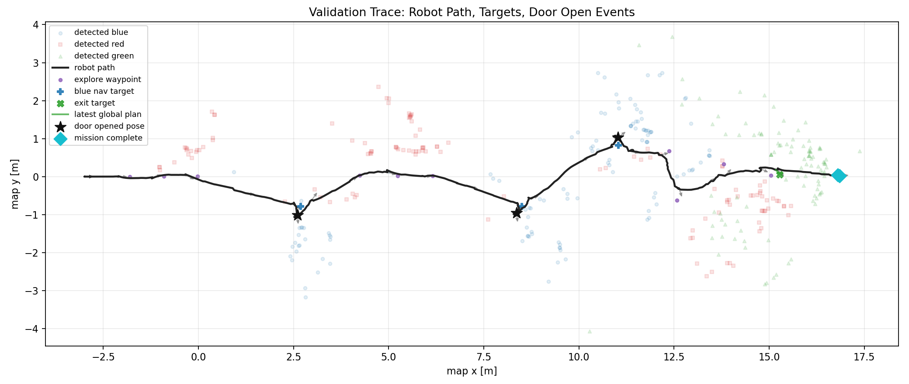
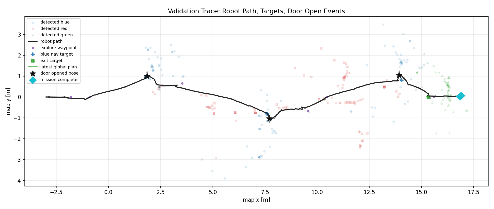
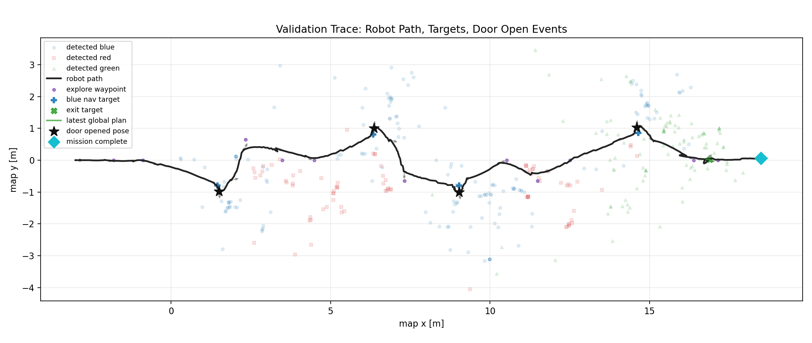
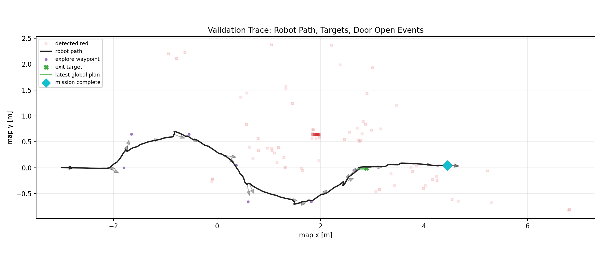
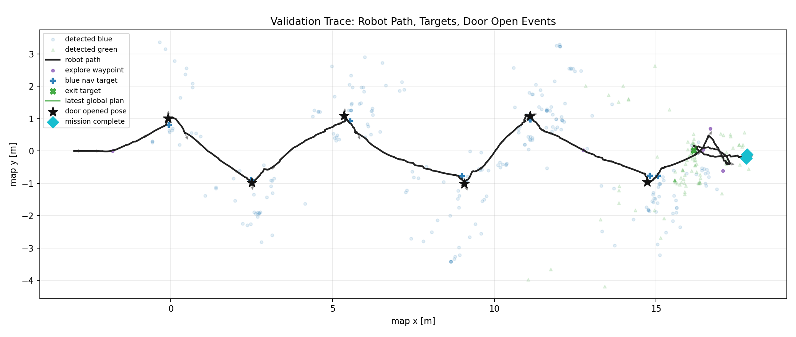
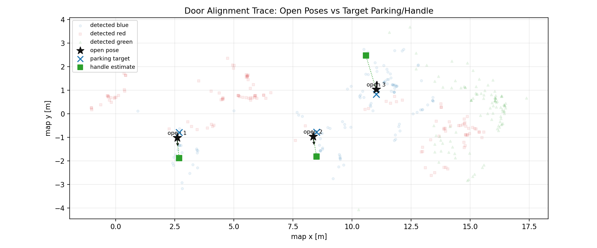
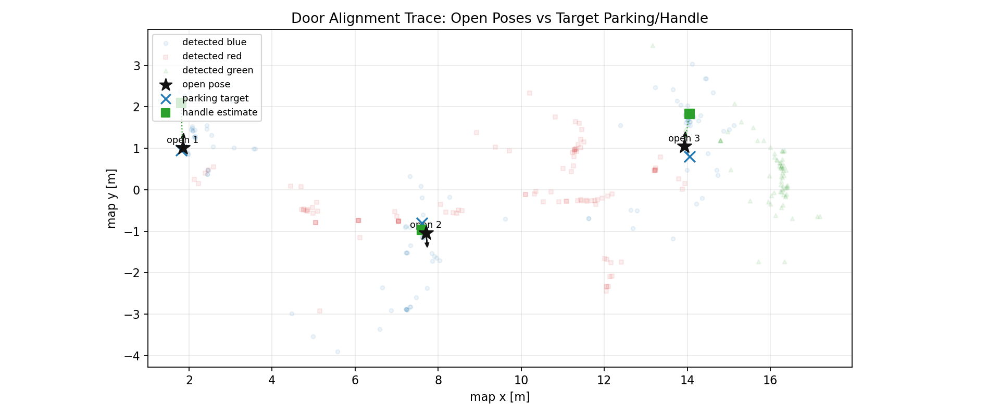
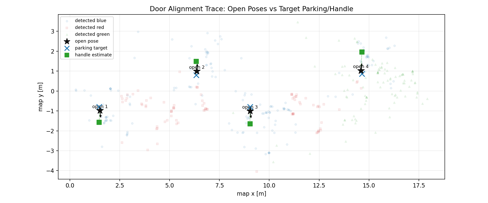
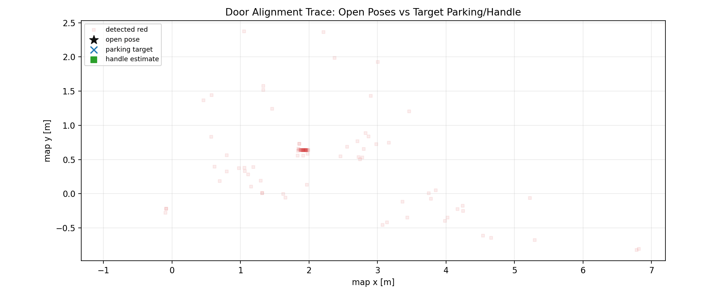
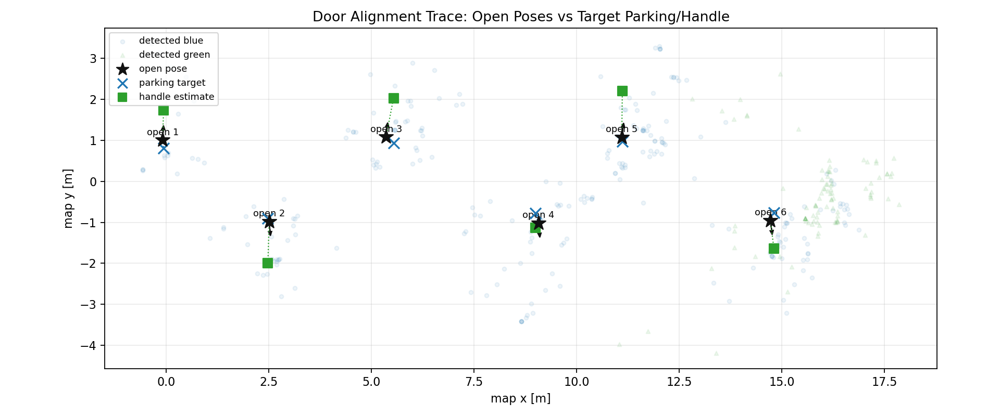

# 2026-08-11 최종 시뮬레이션 검증

검증 태그:

```text
full_worlds_12345_exit_tail_red_guard_20260811
```

## 결과

| 월드 | 조건 | 결과 |
| --- | --- | --- |
| World 1 | 파란문 3개, 빨간문/장애물 혼합 | PASS, 파란문 3/3 |
| World 2 | 다른 문 배열/장애물 배치 | PASS, 파란문 3/3 |
| World 3 | 파란문 4개, 빨간문 2개 | PASS, 파란문 4/4 |
| World 4 | 파란문 없음 | PASS, 비상구 이동 |
| World 5 | 좌우 3개씩 모든 문 파란색 | PASS, 파란문 6/6 |

전체 로그 요약은 [summary.txt](summary.txt)를 확인하세요.

## 궤적 이미지







## 문 앞 정렬 이미지







World 4는 파란문이 없는 no-blue 시나리오라 문 앞 정렬 로그는 0개가 정상입니다.
