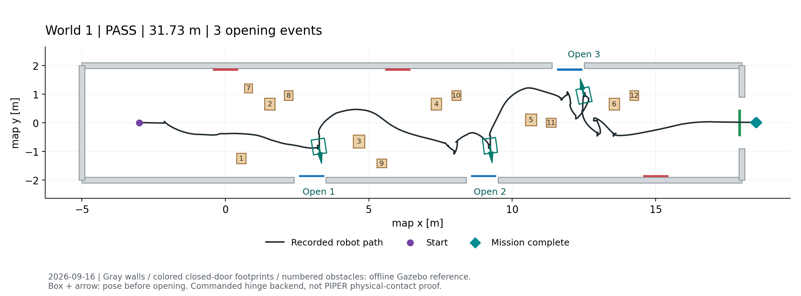
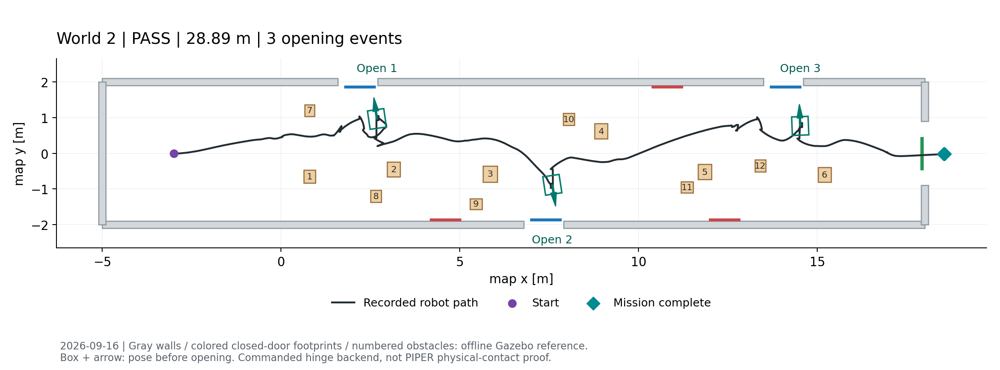
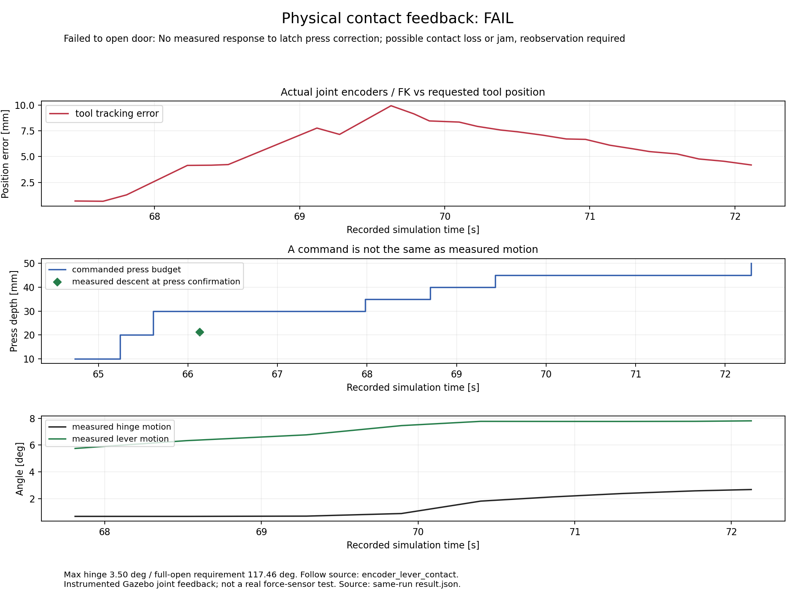
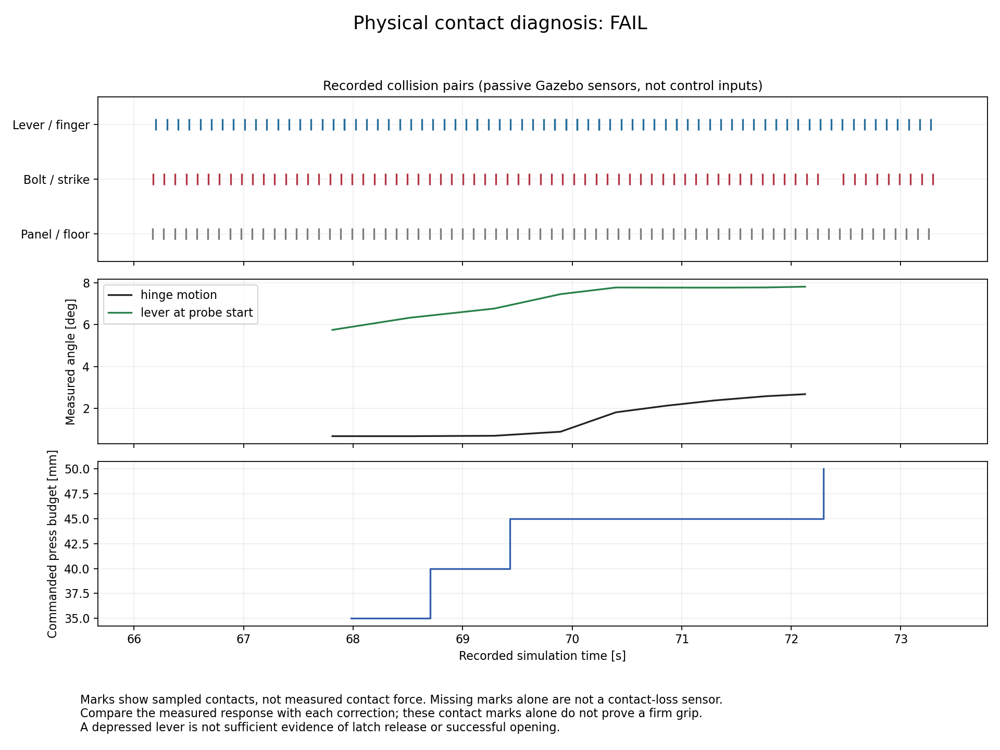

# 2026-09-16 대표 검증 증빙

전체 설명은 [검증 결과](../../VALIDATION_20260916.md), 작업 기준은 [인계 안내](../../TEAM_HANDOFF_20260916.md)를 따른다.

이 폴더는 기존 실행 원본의 조회용 복사본이다. 업로드를 위해 새 시뮬레이션을 실행하지 않았다.
월드 1~2는 r9, 월드 3~5는 r8이며 `validation_set_manifest.json`에 입력/검사/로그 해시와 출처를 기록했다.
원본 호스트 경로는 출처 정보이며 팀원 PC의 실행 경로가 아니다.

## 통합 주행 PASS

저장 지도 + sim odometry + 단순 팔/힌지 명령 backend 조건이다. 장애물 형상은 사후 SDF 참조로 그렸으며 색 점은 투영된 문 관측이다.
정렬 목표와의 오차가 작다는 것과 실제 팔이 손잡이에 닿는다는 것은 별개다.

| 월드 | 경로 | 정렬 |
|---|---|---|
| 1: 파란문 3개 |  | [정렬](world1_alignment.png) |
| 2: 파란문 3개, 다른 배열 |  | [정렬](world2_alignment.png) |
| 3: 파란문 4개 |  | [정렬](world3_alignment.png) |
| 4: 파란문 없음 |  | 개방 없음 |
| 5: 파란문 6개 |  | [정렬](world5_alignment.png) |

[판정표](results.tsv), [닫힌 문 평면 거리 참고값](closed_panel_alignment_reference.json), [월드 변경 감사](world_change_audit.json).
샘플 차체 중첩 0은 연속 물리 무충돌을 증명하지 않는다.

## PIPER 접촉 r21 FAIL

새 피드백 제어의 완전 개방 실패와 안전 정지를 보여주는 자료다. 최대 문 회전은 3.50도이며 기준 117.46도에 미달했다.
레버/힌지 피드백은 Gazebo 관절값이며 실물 센서 검증이 아니다.

[측정 결과 원본](piper_r21_result_FAIL.json). 접촉 표시가 있어도 안정적인 파지/걸쇠 해제를 보장하지 않는다.
